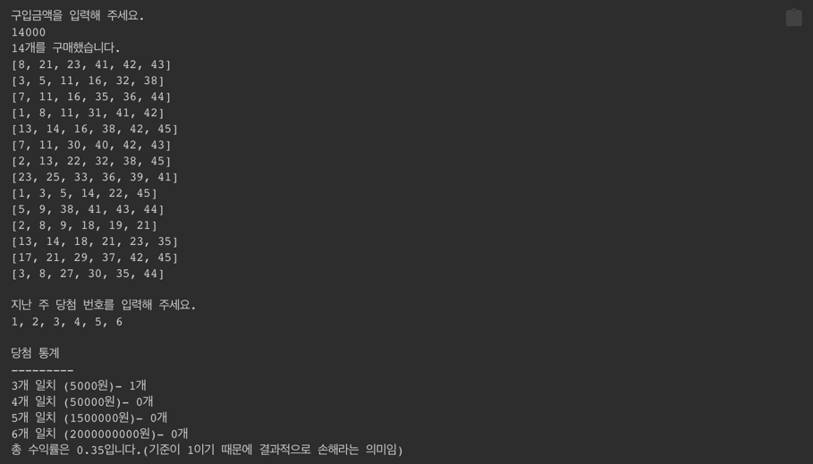

# 로또

## 진행 방법

* 로또 요구사항을 파악한다.
* 요구사항에 대한 구현을 완료한 후 자신의 github 아이디에 해당하는 브랜치에 Pull Request(이하 PR)를 통해 코드 리뷰 요청을 한다.
* 코드 리뷰 피드백에 대한 개선 작업을 하고 다시 PUSH한다.
* 모든 피드백을 완료하면 다음 단계를 도전하고 앞의 과정을 반복한다.

## 온라인 코드 리뷰 과정

* [텍스트와 이미지로 살펴보는 온라인 코드 리뷰 과정](https://github.com/next-step/nextstep-docs/tree/master/codereview)

---

## 기능 요구 사항

### Domain

- [x] 로또를 구매한다.
    - [x] 로또의 가격을 알고 있다.
    - [x] 자동 생성된 로또 번호를 입력된 가격만큼 반환한다.
- [x] 로또 번호를 자동 생성한다.
    - [x] 총 6 개의 번호를 선별한다.
    - [x] 각 번호는 1 ~ 45 사이이며, 중복되지 않는다.
- [x] 당첨 통계를 생성한다.
    - [x] 자동 생성된 로또 번호와 지난 주 당첨 번호를 비교한다.
        - [x] 3 개 일치한 자동 생성 로또 번호 개수
        - [x] 4 개 일치한 자동 생성 로또 번호 개수
        - [x] 5 개 일치한 자동 생성 로또 번호 개수
        - [x] 6 개 일치한 자동 생성 로또 번호 개수
    - [x] 수익률을 계산한다.

### View

> 입력

- [x] 구입금액을 입력 받는다.
    - [x] 정수형으로 1개의 입력 값만 받는다.
- [x] 지난 주 당첨 번호를 입력 받는다.
    - [x] 6 개의 번호를 입력 받는다.
    - [x] 각 번호는 쉼표로 구분되며 공백은 무시된다. (replaceAll)

> 출력

- [x] 당첨 통계를 출력한다.
    - [x] 일치한 개수별 자동 생성 로또 번호의 개수
        - [x] 각 일치한 개수별 상금도 출력

### Controller

- [x] `입력 View` 구입 금액을 입력 받는다.
- [x] `Domain` 구입 금액에 맞는 로또를 구매한다.
- [x] `입력 View` 지난 주 당첨 번호를 입력 받는다.
- [x] `Domain` 구입한 로또와 지난 주 당첨 번호를 비교한다.
- [x] `출력 View` 당첨 통계를 출력한다.
