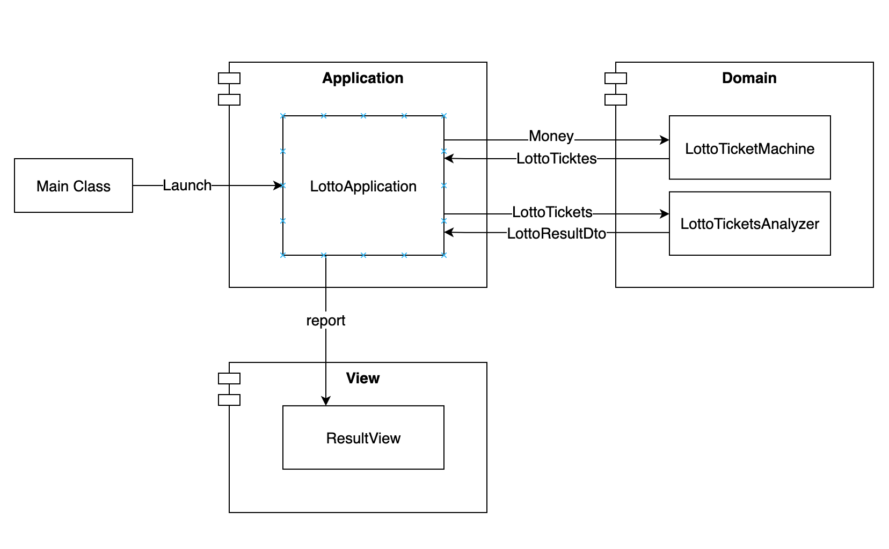

# 로또
## 기능 목록
### Step02
[x] InputView / ResultView 별도로 분리
[x] LottoMachine 클래스 구현
    [x] 금액만큼의 LottoTicket 발행
    [x] 로또 번호 제네레이터 구현
    [x] 자동 로또 티켓 발행
[x] LottoTicket의 List를 감싼 Wrapper 구현 (LottoTickets)
[x] 당첨 번호 발행하는 로직 구현
[x] Front -> Controller -> View로 전달되는 DTO 구성?
[x] 로또 분석기 구현
    [x] LottoTickets, 당첨 번호를 받아 내부의 Ticket들을 이용하여 등수 반환기
    [x] 등수 별 금액 및 조건 ENUM
    [x] 적립된 등수 및 금액 출력

<!--%3CmxGraphModel%3E%3Croot%3E%3CmxCell%20id%3D%220%22%2F%3E%3CmxCell%20id%3D%221%22%20parent%3D%220%22%2F%3E%3CmxCell%20id%3D%222%22%20value%3D%22Domain%26%2310%3B%22%20style%3D%22shape%3Dmodule%3Balign%3Dleft%3BspacingLeft%3D20%3Balign%3Dcenter%3BverticalAlign%3Dtop%3BfontSize%3D14%3BfontStyle%3D1%22%20vertex%3D%221%22%20parent%3D%221%22%3E%3CmxGeometry%20x%3D%22563%22%20y%3D%2280%22%20width%3D%22250%22%20height%3D%22210%22%20as%3D%22geometry%22%2F%3E%3C%2FmxCell%3E%3CmxCell%20id%3D%223%22%20value%3D%22Application%22%20style%3D%22shape%3Dmodule%3Balign%3Dleft%3BspacingLeft%3D20%3Balign%3Dcenter%3BverticalAlign%3Dtop%3BfontSize%3D14%3BfontStyle%3D1%22%20vertex%3D%221%22%20parent%3D%221%22%3E%3CmxGeometry%20x%3D%22203%22%20y%3D%2280%22%20width%3D%22250%22%20height%3D%22210%22%20as%3D%22geometry%22%2F%3E%3C%2FmxCell%3E%3CmxCell%20id%3D%224%22%20value%3D%22View%22%20style%3D%22shape%3Dmodule%3Balign%3Dleft%3BspacingLeft%3D20%3Balign%3Dcenter%3BverticalAlign%3Dtop%3BfontSize%3D14%3BfontStyle%3D1%22%20vertex%3D%221%22%20parent%3D%221%22%3E%3CmxGeometry%20x%3D%22203%22%20y%3D%22360%22%20width%3D%22250%22%20height%3D%22140%22%20as%3D%22geometry%22%2F%3E%3C%2FmxCell%3E%3CmxCell%20id%3D%225%22%20style%3D%22edgeStyle%3DorthogonalEdgeStyle%3Brounded%3D0%3BorthogonalLoop%3D1%3BjettySize%3Dauto%3Bhtml%3D1%3BfontSize%3D14%3B%22%20edge%3D%221%22%20parent%3D%221%22%3E%3CmxGeometry%20relative%3D%221%22%20as%3D%22geometry%22%3E%3CmxPoint%20x%3D%22413%22%20y%3D%22152.54499999999996%22%20as%3D%22sourcePoint%22%2F%3E%3CmxPoint%20x%3D%22623%22%20y%3D%22152.5%22%20as%3D%22targetPoint%22%2F%3E%3CArray%20as%3D%22points%22%3E%3CmxPoint%20x%3D%22573%22%20y%3D%22153%22%2F%3E%3CmxPoint%20x%3D%22573%22%20y%3D%22153%22%2F%3E%3C%2FArray%3E%3C%2FmxGeometry%3E%3C%2FmxCell%3E%3CmxCell%20id%3D%226%22%20value%3D%22Money%22%20style%3D%22edgeLabel%3Bhtml%3D1%3Balign%3Dcenter%3BverticalAlign%3Dmiddle%3Bresizable%3D0%3Bpoints%3D%5B%5D%3BfontSize%3D14%3B%22%20vertex%3D%221%22%20connectable%3D%220%22%20parent%3D%225%22%3E%3CmxGeometry%20x%3D%22-0.0952%22%20y%3D%225%22%20relative%3D%221%22%20as%3D%22geometry%22%3E%3CmxPoint%20x%3D%225%22%20as%3D%22offset%22%2F%3E%3C%2FmxGeometry%3E%3C%2FmxCell%3E%3CmxCell%20id%3D%227%22%20value%3D%22report%22%20style%3D%22edgeStyle%3DorthogonalEdgeStyle%3Brounded%3D0%3BorthogonalLoop%3D1%3BjettySize%3Dauto%3Bhtml%3D1%3BfontSize%3D14%3B%22%20edge%3D%221%22%20parent%3D%221%22%3E%3CmxGeometry%20x%3D%22-0.1456%22%20relative%3D%221%22%20as%3D%22geometry%22%3E%3CmxPoint%20x%3D%22303%22%20y%3D%22260%22%20as%3D%22sourcePoint%22%2F%3E%3CmxPoint%20x%3D%22303%22%20y%3D%22400.45000000000005%22%20as%3D%22targetPoint%22%2F%3E%3CArray%20as%3D%22points%22%3E%3CmxPoint%20x%3D%22303%22%20y%3D%22300%22%2F%3E%3CmxPoint%20x%3D%22303%22%20y%3D%22300%22%2F%3E%3C%2FArray%3E%3CmxPoint%20as%3D%22offset%22%2F%3E%3C%2FmxGeometry%3E%3C%2FmxCell%3E%3CmxCell%20id%3D%228%22%20value%3D%22LottoApplication%22%20style%3D%22html%3D1%3BfontSize%3D14%3B%22%20vertex%3D%221%22%20parent%3D%221%22%3E%3CmxGeometry%20x%3D%22263%22%20y%3D%22130%22%20width%3D%22150%22%20height%3D%22130%22%20as%3D%22geometry%22%2F%3E%3C%2FmxCell%3E%3CmxCell%20id%3D%229%22%20style%3D%22edgeStyle%3DorthogonalEdgeStyle%3Brounded%3D0%3BorthogonalLoop%3D1%3BjettySize%3Dauto%3Bhtml%3D1%3BfontSize%3D14%3B%22%20edge%3D%221%22%20parent%3D%221%22%3E%3CmxGeometry%20relative%3D%221%22%20as%3D%22geometry%22%3E%3CmxPoint%20x%3D%22623%22%20y%3D%22170%22%20as%3D%22sourcePoint%22%2F%3E%3CmxPoint%20x%3D%22413%22%20y%3D%22169.54499999999996%22%20as%3D%22targetPoint%22%2F%3E%3CArray%20as%3D%22points%22%3E%3CmxPoint%20x%3D%22433%22%20y%3D%22170%22%2F%3E%3CmxPoint%20x%3D%22433%22%20y%3D%22170%22%2F%3E%3C%2FArray%3E%3C%2FmxGeometry%3E%3C%2FmxCell%3E%3CmxCell%20id%3D%2210%22%20value%3D%22LottoTicktes%22%20style%3D%22edgeLabel%3Bhtml%3D1%3Balign%3Dcenter%3BverticalAlign%3Dmiddle%3Bresizable%3D0%3Bpoints%3D%5B%5D%3BfontSize%3D14%3B%22%20vertex%3D%221%22%20connectable%3D%220%22%20parent%3D%229%22%3E%3CmxGeometry%20x%3D%220.0095%22%20y%3D%22-2%22%20relative%3D%221%22%20as%3D%22geometry%22%3E%3CmxPoint%20as%3D%22offset%22%2F%3E%3C%2FmxGeometry%3E%3C%2FmxCell%3E%3CmxCell%20id%3D%2211%22%20value%3D%22LottoTicketMachine%22%20style%3D%22html%3D1%3BfontSize%3D14%3B%22%20vertex%3D%221%22%20parent%3D%221%22%3E%3CmxGeometry%20x%3D%22623%22%20y%3D%22130%22%20width%3D%22150%22%20height%3D%2259.09%22%20as%3D%22geometry%22%2F%3E%3C%2FmxCell%3E%3CmxCell%20id%3D%2212%22%20value%3D%22ResultView%22%20style%3D%22html%3D1%3BfontSize%3D14%3B%22%20vertex%3D%221%22%20parent%3D%221%22%3E%3CmxGeometry%20x%3D%22263%22%20y%3D%22400.45%22%20width%3D%22150%22%20height%3D%2259.09%22%20as%3D%22geometry%22%2F%3E%3C%2FmxCell%3E%3CmxCell%20id%3D%2213%22%20value%3D%22LottoTicketsAnalyzer%22%20style%3D%22html%3D1%3BfontSize%3D14%3B%22%20vertex%3D%221%22%20parent%3D%221%22%3E%3CmxGeometry%20x%3D%22623%22%20y%3D%22200.91%22%20width%3D%22150%22%20height%3D%2259.09%22%20as%3D%22geometry%22%2F%3E%3C%2FmxCell%3E%3CmxCell%20id%3D%2214%22%20style%3D%22edgeStyle%3DorthogonalEdgeStyle%3Brounded%3D0%3BorthogonalLoop%3D1%3BjettySize%3Dauto%3Bhtml%3D1%3BfontSize%3D14%3B%22%20edge%3D%221%22%20parent%3D%221%22%3E%3CmxGeometry%20relative%3D%221%22%20as%3D%22geometry%22%3E%3CmxPoint%20x%3D%22413%22%20y%3D%22221.4749999999999%22%20as%3D%22sourcePoint%22%2F%3E%3CmxPoint%20x%3D%22623%22%20y%3D%22221.43000000000006%22%20as%3D%22targetPoint%22%2F%3E%3CArray%20as%3D%22points%22%3E%3CmxPoint%20x%3D%22573%22%20y%3D%22221.93%22%2F%3E%3CmxPoint%20x%3D%22573%22%20y%3D%22221.93%22%2F%3E%3C%2FArray%3E%3C%2FmxGeometry%3E%3C%2FmxCell%3E%3CmxCell%20id%3D%2215%22%20value%3D%22LottoTickets%22%20style%3D%22edgeLabel%3Bhtml%3D1%3Balign%3Dcenter%3BverticalAlign%3Dmiddle%3Bresizable%3D0%3Bpoints%3D%5B%5D%3BfontSize%3D14%3B%22%20vertex%3D%221%22%20connectable%3D%220%22%20parent%3D%2214%22%3E%3CmxGeometry%20x%3D%22-0.0952%22%20y%3D%225%22%20relative%3D%221%22%20as%3D%22geometry%22%3E%3CmxPoint%20x%3D%225%22%20y%3D%222%22%20as%3D%22offset%22%2F%3E%3C%2FmxGeometry%3E%3C%2FmxCell%3E%3CmxCell%20id%3D%2216%22%20style%3D%22edgeStyle%3DorthogonalEdgeStyle%3Brounded%3D0%3BorthogonalLoop%3D1%3BjettySize%3Dauto%3Bhtml%3D1%3BfontSize%3D14%3B%22%20edge%3D%221%22%20parent%3D%221%22%3E%3CmxGeometry%20relative%3D%221%22%20as%3D%22geometry%22%3E%3CmxPoint%20x%3D%22623%22%20y%3D%22238.93000000000006%22%20as%3D%22sourcePoint%22%2F%3E%3CmxPoint%20x%3D%22413%22%20y%3D%22238.4749999999999%22%20as%3D%22targetPoint%22%2F%3E%3CArray%20as%3D%22points%22%3E%3CmxPoint%20x%3D%22433%22%20y%3D%22238.93%22%2F%3E%3CmxPoint%20x%3D%22433%22%20y%3D%22238.93%22%2F%3E%3C%2FArray%3E%3C%2FmxGeometry%3E%3C%2FmxCell%3E%3CmxCell%20id%3D%2217%22%20value%3D%22LottoResultDto%22%20style%3D%22edgeLabel%3Bhtml%3D1%3Balign%3Dcenter%3BverticalAlign%3Dmiddle%3Bresizable%3D0%3Bpoints%3D%5B%5D%3BfontSize%3D14%3B%22%20vertex%3D%221%22%20connectable%3D%220%22%20parent%3D%2216%22%3E%3CmxGeometry%20x%3D%220.0095%22%20y%3D%22-2%22%20relative%3D%221%22%20as%3D%22geometry%22%3E%3CmxPoint%20y%3D%221.0899999999999999%22%20as%3D%22offset%22%2F%3E%3C%2FmxGeometry%3E%3C%2FmxCell%3E%3CmxCell%20id%3D%2218%22%20style%3D%22edgeStyle%3DorthogonalEdgeStyle%3Brounded%3D0%3BorthogonalLoop%3D1%3BjettySize%3Dauto%3Bhtml%3D1%3BfontSize%3D14%3B%22%20edge%3D%221%22%20source%3D%2220%22%20target%3D%228%22%20parent%3D%221%22%3E%3CmxGeometry%20relative%3D%221%22%20as%3D%22geometry%22%2F%3E%3C%2FmxCell%3E%3CmxCell%20id%3D%2219%22%20value%3D%22Launch%22%20style%3D%22edgeLabel%3Bhtml%3D1%3Balign%3Dcenter%3BverticalAlign%3Dmiddle%3Bresizable%3D0%3Bpoints%3D%5B%5D%3BfontSize%3D14%3B%22%20vertex%3D%221%22%20connectable%3D%220%22%20parent%3D%2218%22%3E%3CmxGeometry%20x%3D%220.3%22%20y%3D%224%22%20relative%3D%221%22%20as%3D%22geometry%22%3E%3CmxPoint%20x%3D%22-41%22%20y%3D%222%22%20as%3D%22offset%22%2F%3E%3C%2FmxGeometry%3E%3C%2FmxCell%3E%3CmxCell%20id%3D%2220%22%20value%3D%22Main%20Class%22%20style%3D%22html%3D1%3BfontSize%3D14%3B%22%20vertex%3D%221%22%20parent%3D%221%22%3E%3CmxGeometry%20x%3D%2213%22%20y%3D%22170%22%20width%3D%22110%22%20height%3D%2250%22%20as%3D%22geometry%22%2F%3E%3C%2FmxCell%3E%3C%2Froot%3E%3C%2FmxGraphModel%3E-->
