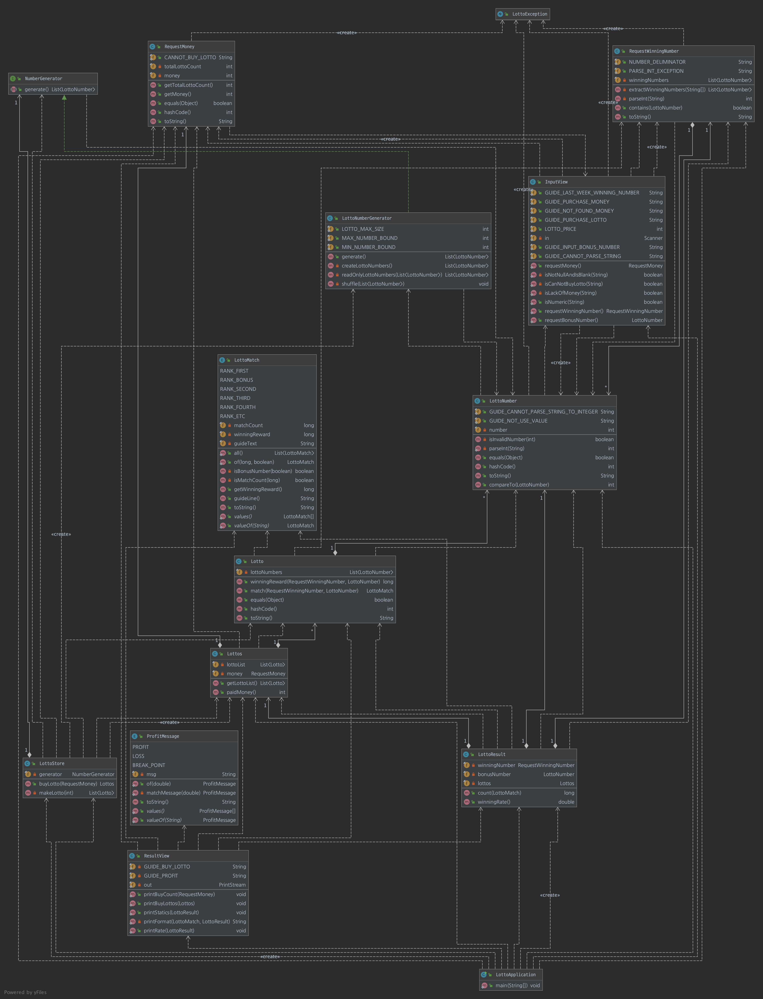
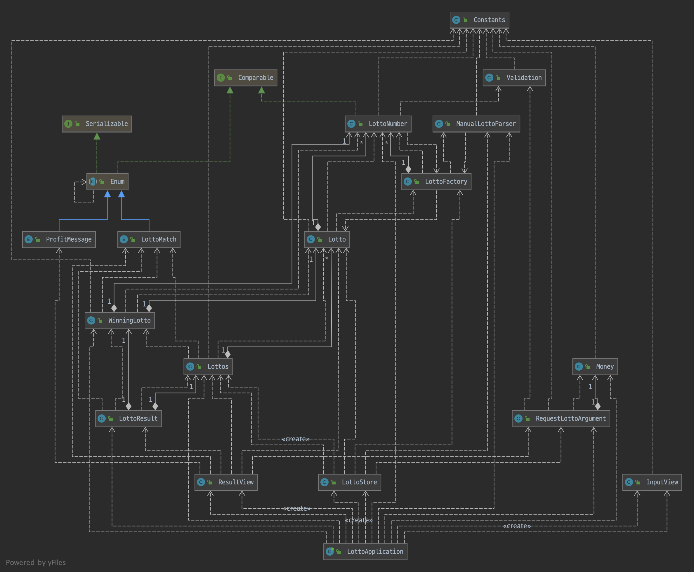

# 로또
## 진행 방법
* 로또 요구사항을 파악한다.
* 요구사항에 대한 구현을 완료한 후 자신의 github 아이디에 해당하는 브랜치에 Pull Request(이하 PR)를 통해 코드 리뷰 요청을 한다.
* 코드 리뷰 피드백에 대한 개선 작업을 하고 다시 PUSH한다.
* 모든 피드백을 완료하면 다음 단계를 도전하고 앞의 과정을 반복한다.

## 온라인 코드 리뷰 과정
* [텍스트와 이미지로 살펴보는 온라인 코드 리뷰 과정](https://github.com/next-step/nextstep-docs/tree/master/codereview)

## 문자열 덧셈 계산기
- 데이터 타입이 될 객체
    - Number
    - Numbers (일급 컬렉션)
        - List<Number>를 만들기 위해 필요한 Pattern을 적용

- 실제 데이터를 처리할 객체
    - StringAddCalculator
    
- 데이터를 가공할 객체
    - Pattern
        - CustomPattern
        - DefaultPattern

> 1차 피드백
- [매직넘버란? -> 어려운 리터럴 문자를 쉽게 이해하기 위함인데 상수화가 꼭 필요한지?](https://github.com/next-step/java-lotto/pull/1242#discussion_r594298154)
- [조건문도 메서드 시그니처를 통해 의미 부여하기](https://github.com/next-step/java-lotto/pull/1242#discussion_r594304155)
- [getter는 도메인 로직에서 최대한 줄이기](https://github.com/next-step/java-lotto/pull/1242#discussion_r594307685)
- [요구사항 미흡 (음수 값 예외처리)](https://github.com/next-step/java-lotto/pull/1242#discussion_r594310922)

## 로또
- 기능 요구사항
    - 로또 구입 금액을 입력하면 구입 금액에 해당하는 로또를 발급해야 한다.
    - 로또 1장의 가격은 1000원이다.
    - 지난 주의 당첨 번호 6개를 입력
    - 구매했던 로또 번호와 비교하여 당첨 통계를 출력

- 프로그래밍 요구사항
    - 모든 기능을 TDD로 구현해 단위 테스트가 존재해야 한다.
    - indent(인덴트, 들여쓰기) depth를 2를 넘지 않도록 구현한다. 1까지만 허용한다.
    - 함수(또는 메소드)의 길이가 15라인을 넘어가지 않도록 구현한다.
    - 모든 로직에 단위 테스트를 구현한다.
    - 자바 코드 컨벤션을 지키면서 프로그래밍한다.
    - else 예약어를 쓰지 않는다.

- 힌트
    - 로또 자동 생성은 Collections.shuffle() 메소드 활용한다.
    - Collections.sort() 메소드를 활용해 정렬 가능하다.
    - ArrayList의 contains() 메소드를 활용하면 어떤 값이 존재하는지 유무를 판단할 수 있다.

- 개요 작성하기
    - 로또게임 시작 (LottoGame)
        - 사용자 -> 구매할 금액을 지불하기 (InputView -> Money)
        - 지불한 금액 -> 로또 구매하기 (RequestMoney -> Lottos)
        - 지난주 당첨 번호 입력 (Lotto)
        - 구매한 로또의 통계 보기 (resultView)

> 1차 피드백
- [long 반환 타입인데 중복되는 로직 삭제](https://github.com/next-step/java-lotto/pull/1255#discussion_r595985358)
- [return 로직 위치 변경](https://github.com/next-step/java-lotto/pull/1255#discussion_r595986529)
- [굳이 없어도 되는 Getter 삭제](https://github.com/next-step/java-lotto/pull/1255#discussion_r595990045)

### 로또(2등)
- 기능 요구사항
    - 2등을 위해 추가 번호를 하나 더 추첨한다.
    - 당첨 통계에 2등도 추가해야 한다.

- 프로그래밍 요구사항
    - 모든 기능을 `TDD`로 구현해 단위 테스트가 존재해야 한다. 
      단, UI(System.out, System.in) 로직은 제외
    - `java enum`을 적용해 프로그래밍을 구현한다.
    - 규칙 8: `일급 콜렉션`을 쓴다.
    - `indent(인덴트, 들여쓰기) depth를 2`를 넘지 않도록 구현한다. 1까지만 허용한다.
    - 함수(또는 메소드)의 길이가 `15라인`을 넘어가지 않도록 구현한다.
    - `자바 코드 컨벤션`을 지키면서 프로그래밍한다.
    - `else 예약어`를 쓰지 않는다.

- 힌트
    - 일급 콜렉션을 쓴다.
        - 6개의 숫자 값을 가지는 java collection을 감싸는 객체를 추가해 구현해 본다.
        - 하드 코딩을 하지 않기 위해 상수 값을 사용하면 많은 상수 값이 발생한다. 
        - 자바의 enum을 활용해 상수 값을 제거한다. 
        - 즉, enum을 활용해 일치하는 수를 로또 등수로 변경해 본다.
    
- 생각하기
    - 객체에 존재하는 메서드가 테스트하기 위해서 너무 많은 사전 코드가 필요한 경우 
      그 기능이 해당 객체에 존재하는게 맞는지 생각하기

- 진행 순서
    - 보너스 번호라는 값은 기존에 있던 LottoNumber 객체로 관리될 수 있다.
    - LottoMatch 라는 enum 에서 보너스 번호 유무에 따라서 당첨금을 반환할 수 있으므로 필터링 추가
    - List<LottoNumber>라는 컬렉션을 갖고 있는 일급 컬렉션인 Lotto 클래스의 winningReward, match 메서드에 bonus 파라미터 추가
    - 로또 결과를 관리하는 LottoResult 클래스에서 LottoNumber(BonusNumber)를 관리할 수 있도록 필드 추가 및 관련 메서드에 파라미터로 추가  

> 1차 피드백
- [꼭 필요한 주석?](https://github.com/next-step/java-lotto/pull/1261#discussion_r596771924)
- [엘레강트 오브젝트](https://github.com/next-step/java-lotto/pull/1261#discussion_r596800376)
- [지엽적인 변수명](https://github.com/next-step/java-lotto/pull/1261#discussion_r596801645)
- [순환참조 구조](https://github.com/next-step/java-lotto/pull/1261#discussion_r596803272)
- [compareTo 이슈 발생 가능성](https://github.com/next-step/java-lotto/pull/1261#discussion_r596806649)
- [연산처리](https://github.com/next-step/java-lotto/pull/1261#discussion_r596810848)
- [메서드 내에 유효성검사 간결하게 표현하기](https://github.com/next-step/java-lotto/pull/1261#discussion_r596825348)
- [객체의 상태값 관리 생각하기](https://github.com/next-step/java-lotto/pull/1261#discussion_r596829039)

## 로또 (수동)
- 기능 요구사항
    - 현재 로또 생성기는 자동 생성 기능만 제공한다. 사용자가 수동으로 추첨 번호를 입력할 수 있도록 해야 한다.
    - 입력한 금액, 자동 생성 숫자, 수동 생성 번호를 입력하도록 해야 한다.

- 프로그래밍 요구사항
    - 프로그래밍 요구사항
    - 규칙 3: 모든 원시값과 문자열을 포장한다.
    - 규칙 5: 줄여쓰지 않는다(축약 금지).
    - 예외 처리를 통해 에러가 발생하지 않도록 한다.
    - 모든 기능을 TDD로 구현해 단위 테스트가 존재해야 한다. 단, UI(System.out, System.in) 로직은 제외
    - java enum을 적용해 프로그래밍을 구현한다.
    - 규칙 8: 일급 콜렉션을 쓴다.
    - indent(인덴트, 들여쓰기) depth를 2를 넘지 않도록 구현한다. 1까지만 허용한다.
    - 함수(또는 메소드)의 길이가 15라인을 넘어가지 않도록 구현한다.
    - 자바 코드 컨벤션을 지키면서 프로그래밍한다.
    - else 예약어를 쓰지 않는다.

- 힌트
    - 규칙 3: 모든 원시값과 문자열을 포장한다.
    - 로또 숫자 하나는 int 타입이다. 이 숫자 하나를 추상화한 LottoNo 객체를 추가해 구현한다.
    - 예외 처리를 통해 에러가 발생하지 않도록 한다.
    - 사용자가 잘못된 값을 입력했을 때 java exception으로 에러 처리를 한다.
    - java8에 추가된 Optional을 적용해 NullPointerException이 발생하지 않도록 한다.

- 진행 순서
    - 결합도가 높은 파라미터는 Wrapper 클래스로 만들어 관리할 수 있도록 생성
    - 숫자 수동으로 생성하는 클래스 작성
    - 수동 숫자, 로또 숫자 수동 로직 추가
    - 기존 테스트는 깨지지 않도록 최대한 생성자를 이용

> 1차 피드백
- [기본 생성자가 꼭 필요한 것인지?](https://github.com/next-step/java-lotto/pull/1273#discussion_r598077223)
- [메서드 컨벤션](https://github.com/next-step/java-lotto/pull/1273#discussion_r598077620)
- [연산 최소화하기](https://github.com/next-step/java-lotto/pull/1273#discussion_r598077940)
- [boolean 반환 타입 메서드 컨벤션](https://github.com/next-step/java-lotto/pull/1273#discussion_r598078056)
- [객체 책임](https://github.com/next-step/java-lotto/pull/1273#discussion_r598078595)
- [객체 비교 테스트](https://github.com/next-step/java-lotto/pull/1273#discussion_r598078862)
- [JUnit API 더 알아보기](https://github.com/next-step/java-lotto/pull/1273#discussion_r598078901)
- [예외가 발생하는 시나리오를 파악하기 -> 무분별한 테스트 코드 X](https://github.com/next-step/java-lotto/pull/1273#discussion_r598079069)
- [인터페이스를 통한 여러 구현체를 사용하는 장점에 대해서 생각해보기](https://github.com/next-step/java-lotto/pull/1273#discussion_r598079685)
- [static 메서드로 구성된 클래스는 맞는건가?](https://github.com/next-step/java-lotto/pull/1273#discussion_r598080023)

- 고민하기
  - static을 없애기 위해서 어떻게 처리하는게 좋을까
  - 코드가 너무 자유분방한데 어떻게 응집도있게 짤 수 있을까?
    - 인터페이스를 통한 명세로 정리해보기
  - 낮은 결합도를 위해 View와 domain 사이의 데이터 전달을 기본 라이브러리를 사용하도록 변경
  - 객체가 다양한 타입의 파라미터를 받지 못하고 있음
  - 전체적인 구조 변경

