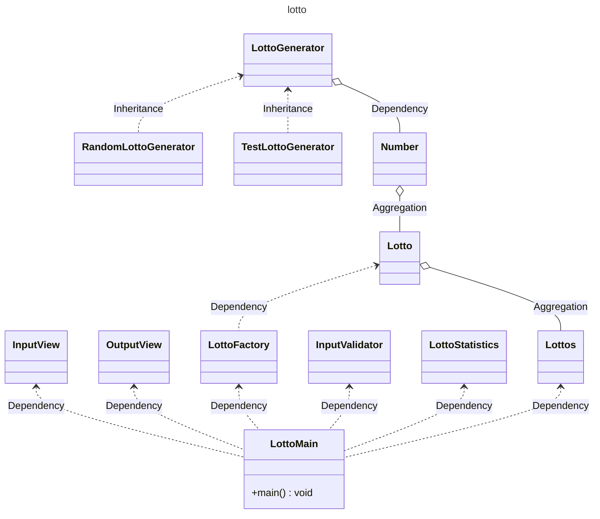

# 로또
## 진행 방법
* 로또 요구사항을 파악한다.
* 요구사항에 대한 구현을 완료한 후 자신의 github 아이디에 해당하는 브랜치에 Pull Request(이하 PR)를 통해 코드 리뷰 요청을 한다.
* 코드 리뷰 피드백에 대한 개선 작업을 하고 다시 PUSH한다.
* 모든 피드백을 완료하면 다음 단계를 도전하고 앞의 과정을 반복한다.

---

## Class Diagram

---

## ToDo

* [X] 숫자 형식의 로또 구입 금액을 입력 받는다.
* [X] 가격이 부족하여 로또를 구매할 수 없을 경우 예외가 발생한다.
* [X] 로또 구입 금액 단위가 1000원이 아닐 경우 예외가 발생한다.
* [ ] 구입한 로또 개수 만큼 6자리의 숫자로 이루어진 로또가 화면에 출력된다.
* [ ] 로또 번호는 1부터 45까지 이다.
* [ ] 지난 주 당첨 번호인 숫자 6자리를 쉼표로 구분하여 입력한다.
* [ ] 구입한 로또와 당첨 번호를 비교하여 당첨 통계를 화면에 출력한다.
* [ ] 구입한 금액과 당첨 해서 받은 로또 금액을 비교하여 총 수익률을 소수점 두자리까지에 한정하여 출력한다.

---

## 온라인 코드 리뷰 과정
* [텍스트와 이미지로 살펴보는 온라인 코드 리뷰 과정](https://github.com/next-step/nextstep-docs/tree/master/codereview)