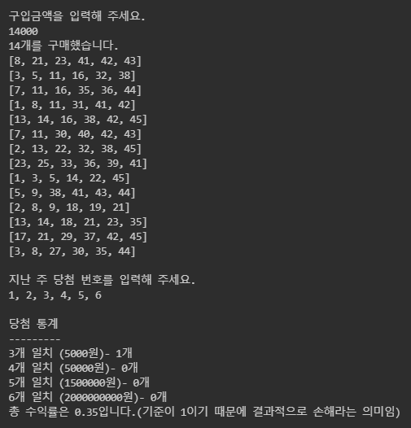

로또 - TDD
=========================================

1단계 - 문자열 계산기
---------------------------------------------
---------------------------------------------

### 기능 분리
- [ ] 연산자
    - 더하기
    - 빼기
    - 나누기
    - 곱하기
- [ ] 입력값 검증
    - null or empty 이면 IllegalArgumentException 예외 발생
- [ ] 연산 검증
    - 사칙연산 값이 아닌 경우 IllegalArgumentException 예외 발생
- [ ] 숫자 체크
    - 숫자 값이 아닌 경우 IllegalArgumentException 예외 발생
- [ ] 문자 분리
    - 문자를 공백에 따라 분리 한다.
- [ ] 계산기
    - 사칙연산의 우선순위가 아니라 입력 값에 따라 사칙 연산을 한다,
- 1단계 - 문자열 계산기
---------------------------------------------

2단계 - 문자열 계산기
---------------------------------------------
---------------------------------------------

### 기능 분리
- #### View
    - 입력 View
        - [ ] 구입 금액을 입력 받는다
        - [ ] 지난 주 당첨 번호를 입력 받는다.
    - 출력 View
        - [ ] 구입한 로또의 갯수를 보여준다.
        - [ ] 구입한 로또 목록을 보여준다
        - [ ] 당첨 통계를 보여준다

- #### 로직
    - 로또 생성기
        - [ ] 로또 금액은 한장당 1000원이다.
        - [ ] 입력 받은 금액 만큼의 로또를 발급한다.
    - 로또 번호 생성기
        - [ ] 각 로또번호는 랜덤으로 생성된다. 1 부터 45 까지의 숫자이다. 총 6개의 로또번호를 생성한다
    - 로또 결과 비교
        - [ ] 구입한 로또와 당첨 결과를 비교한다.
        - [ ] 구입한 로또의 당첨 통계를 만든다. 각 등수 횟수와 수익률을 표시한다
    - 로또 당첨 조건
        - [ ] 당첨 조건을 확인 한다
            - [ ] 1등 : 6개 일치, 2,000,000,000 원
            - [ ] 2등 : 5개 일치, 1,500,000 원
            - [ ] 3등 : 4개 일치, 50,000 원
            - [ ] 4등 : 3개 일치, 5,000 원
            - [ ] 미당첨 : 2개 이하, 0 원

### 예시 화면

---------------------------------------------
