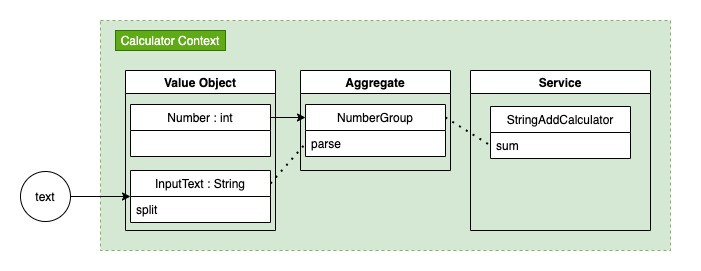

# 2단계 - 문자열 덧셈 계산기
## 1. 요구사항 정의
### 1.1. 기능 요구사항
|요구사항|힌트|
|:---|---|
|• 쉼표(,) 또는 콜론(:)을 구분자로 가지는 문자열을 전달하는 경우 구분자를 기준으로 분리한 각 숫자의 합을 반환 (예: “” => 0, "1,2" => 3, "1,2,3" => 6, “1,2:3” => 6)|• **_1.2. 참고_** 내용 확인|
|• 앞의 기본 구분자(쉼표, 콜론)외에 커스텀 구분자를 지정할 수 있다. 커스텀 구분자는 문자열 앞부분의 “//”와 “\n” 사이에 위치하는 문자를 커스텀 구분자로 사용한다. 예를 들어 “//;\n1;2;3”과 같이 값을 입력할 경우 커스텀 구분자는 세미콜론(;)이며, 결과 값은 6이 반환되어야 한다.|• **_1.2. 참고_** 내용 확인|
|• 문자열 계산기에 숫자 이외의 값 또는 음수를 전달하는 경우 RuntimeException 예외를 throw한다.|• **_1.2. 참고_** 내용 확인|

#### 1.1.1. 참고
##### 1.1.1.1. 빈 문자열 또는 null 값을 입력할 경우 0을 반환해야 한다.(예 : “” => 0, null => 0)
```java
if (text == null) {}
if (text.isEmpty()) {}
```
##### 1.1.1.2. 숫자 하나를 문자열로 입력할 경우 해당 숫자를 반환한다.(예 : “1”)
```java
int number = Integer.parseInt(text);
```
##### 1.1.1.3. 숫자 두개를 컴마(,) 구분자로 입력할 경우 두 숫자의 합을 반환한다.(예 : “1,2”)
```java
String[] numbers = text.split(",");
// 앞 단계의 구분자가 없는 경우도 split()을 활용해 구현할 수 있는지 검토해 본다.
```
##### 1.1.1.4. 구분자를 컴마(,) 이외에 콜론(:)을 사용할 수 있다. (예 : “1,2:3” => 6)
```java
String[] tokens= text.split(",|:");
```
##### 1.1.1.5. “//”와 “\n” 문자 사이에 커스텀 구분자를 지정할 수 있다. (예 : “//;\n1;2;3” => 6)
```java
// java.util.regex 패키지의 Matcher, Pattern import
Matcher m = Pattern.compile("//(.)\n(.*)").matcher(text);
if (m.find()) {
    String customDelimiter = m.group(1);
    String[] tokens= m.group(2).split(customDelimiter);
    // 덧셈 구현
}
```
##### 1.1.1.6. 음수를 전달할 경우 RuntimeException 예외가 발생해야 한다. (예 : “-1,2,3”)
- 구글에서 “junit4 expected exception”으로 검색해 해결책을 찾는다.
<br>
  
### 1.2. 프로그래밍 요구사항
|구분|상세|구현 방법|비고|
|:---:|:---|---|---|
|메소드 분리|• indent(인덴트, 들여쓰기) depth를 2가 넘지 않도록 구현한다. 1까지만 허용한다.<br>&nbsp;&nbsp;• 예를 들어 while문 안에 if문이 있으면 들여쓰기는 2이다.<br>&nbsp;&nbsp;• **힌트: indent(인덴트, 들여쓰기) depth를 줄이는 좋은 방법은 함수(또는 메소드)를 분리**하면 된다.|- < 2depth 규칙||
|메소드 분리|• else 예약어를 쓰지 않는다.<br>&nbsp;&nbsp;• 힌트: if 조건절에서 값을 return하는 방식으로 구현하면 else를 사용하지 않아도 된다.<br>&nbsp;&nbsp;• else를 쓰지 말라고 하니 switch/case로 구현하는 경우가 있는데 switch/case도 허용하지 않는다.|- else 예약어 금지||
|메소드 분리|• 함수(또는 메소드)의 길이가 10라인을 넘어가지 않도록 구현한다.<br>&nbsp;&nbsp;• 함수(또는 메소드)가 한 가지 일만 잘 하도록 구현한다.|- 함수(또는 메서드) 10라인 이하||

<br>

### 1.3. TestCase 소스 코드
```java
import org.junit.jupiter.api.Test;

import static org.assertj.core.api.Assertions.assertThat;
import static org.assertj.core.api.Assertions.assertThatThrownBy;

public class StringAddCalculatorTest {
    @Test
    public void splitAndSum_null_또는_빈문자() {
        int result = StringAddCalculator.splitAndSum(null);
        assertThat(result).isEqualTo(0);

        result = StringAddCalculator.splitAndSum("");
        assertThat(result).isEqualTo(0);
    }

     @Test
    public void splitAndSum_숫자하나() throws Exception {
        int result = StringAddCalculator.splitAndSum("1");
        assertThat(result).isEqualTo(1);
    }

    @Test
    public void splitAndSum_쉼표구분자() throws Exception {
        int result = StringAddCalculator.splitAndSum("1,2");
        assertThat(result).isEqualTo(3);
    }

    @Test
    public void splitAndSum_쉼표_또는_콜론_구분자() throws Exception {
        int result = StringAddCalculator.splitAndSum("1,2:3");
        assertThat(result).isEqualTo(6);
    }

    @Test
    public void splitAndSum_custom_구분자() throws Exception {
        int result = StringAddCalculator.splitAndSum("//;\n1;2;3");
        assertThat(result).isEqualTo(6);
    }

    @Test
    public void splitAndSum_negative() throws Exception {
        assertThatThrownBy(() -> StringAddCalculator.splitAndSum("-1,2,3"))
                .isInstanceOf(RuntimeException.class);
    }
}
```
• [AssertJ Exception Assertions](https://joel-costigliola.github.io/assertj/assertj-core-features-highlight.html#exception-assertion) 문서 참고

### 1.4. 코드리뷰 요청 및 피드백
- 실습을 끝내면 [코드 리뷰 1단계](https://github.com/next-step/nextstep-docs/blob/master/codereview/review-step1.md) 문서의 7단계, 8단계를 참고해 자신의 저장소에 push한다.
- 온라인 코드리뷰 요청 1단계 동영상<br>
  [](https://www.youtube.com/watch?v=YkgBUt7zG5k)

- 코드 리뷰 2단계 문서를 참고해 코드 리뷰 요청(pull request)을 보내고, NextStep 우측 상단의 Github 아이콘을 클릭해 리뷰 요청을 보낸다.
- 피드백 또는 merge 될 때까지 기다린다.
> PR에 대한 수정 요청을 받아 코드를 수정하는 경우 새로운 PR을 보낼 필요가 없다.<br>
코드를 수정한 후 add/commit/push만 하면 자동으로 해당 PR에 추가된다.

- 온라인 코드리뷰 요청 2단계 동영상<br>
  [](https://www.youtube.com/watch?v=HnTdFJd0PtU)
  <br>

### 1.5. 다음 단계 미션 진행을 위한 준비
- Slack을 통해 merge가 되는지 확인한 후에 [코드 리뷰 3단계](https://github.com/next-step/nextstep-docs/blob/master/codereview/review-step3.md) 과정으로 다음 단계 미션을 진행한다.
- 온라인 코드리뷰 요청 3단계 동영상<br>
  [](https://www.youtube.com/watch?v=fzrT3eoecUw)
  <br>

## 2. 분석 및 설계
### 2.1. 이번 Step 핵심 목표
- TDD (Test-Driven Developmet) : production code보다 test code를 먼저 작성한다.
> Cycle : Test Fail ---> Test Passes ---> Refactor ---> Test Fail ---> ...
<br>

### 2.2. Todo List
- [x] 0.기본 세팅
    - [x] 0-1.git fork/clone
    - [x] 0-2.요구사항 정리
    - [x] 0-3.[AngularJS Commit Message Conventions](https://gist.github.com/stephenparish/9941e89d80e2bc58a153#generating-changelogmd) 참고
    - [x] 0-4.Slack을 통해 merge가 되는지 확인한 후에 코드 리뷰 3단계 과정으로 다음 단계 미션을 진행
        - [x] 0-4-1.gregolee(master) branch로 체크아웃 : `git checkout gregolee`
        - [x] 0-4-2.step1 branch 삭제 : `git branch -D step1`
        - [x] 0-4-3.step1 branch 삭제 확인 : `git branch -a`
        - [x] 0-4-4.원본(next-step) git repository를 remote로 연결 (미션 당 1회) : `git remote add -t gregolee upstream https://github.com/next-step/java-lotto`
        - [x] 0-4-5.원본(next-step) git repository를 remote로 연결 확인 : `git remote -v`
        - [x] 0-4-6.원본(next-step) git repository에서 merge된 나의 branch(gregolee)를 fetch : `git fetch upstream gregolee`
        - [x] 0-4-7.remote에서 가져온 나의 branch로 rebase : `git rebase upstream/gregolee`
        - [x] 0-4-7.gregolee -> step2로 체크아웃 : `git checkout -b step2`
- [x] 1.자바 코드 컨벤션을 위한 세팅
    - [x] 1-1.[gradle-editorconfig](https://naver.github.io/hackday-conventions-java/#editorconfig) 적용
    - [x] 1-2.[gradle-checkstyle](https://naver.github.io/hackday-conventions-java/#checkstyle) 적용
    - [x] 1-3.[IntelliJ](https://naver.github.io/hackday-conventions-java/#_intellij) 적용
    - [x] 1-4.[Github](https://naver.github.io/hackday-conventions-java/#_github) 적용
- [x] 2.학습
    - [x] 2-1.[AssertJ Exception Assertions](https://joel-costigliola.github.io/assertj/assertj-core-features-highlight.html#exception-assertion) 문서 참고
    - [x] 2-2.junit4 expected exception 검색
    - [x] 2-3.[온라인 코드리뷰 요청 1단계 동영상](https://www.youtube.com/watch?v=YkgBUt7zG5k)
    - [x] 2-4.[온라인 코드리뷰 요청 2단계 동영상](https://www.youtube.com/watch?v=HnTdFJd0PtU)
    - [x] 2-5.[온라인 코드리뷰 요청 3단계 동영상](https://www.youtube.com/watch?v=fzrT3eoecUw)
- [x] 3.분석 및 설계
    - [x] 3-1.Step02.md 작성
    - [x] 3-2.도메인 주도 설계 이미지 작성
- [x] 4.구현
    - [x] 4-1.StringAddCalculator
        - [x] 4-1-1.splitAndSum_null_또는_빈문자
        - [x] 4-1-2.splitAndSum_숫자하나
        - [x] 4-1-3.splitAndSum_쉼표구분자
        - [x] 4-1-4.splitAndSum_쉼표_또는_콜론_구분자
        - [x] 4-1-5.splitAndSum_custom_구분자
        - [x] 4-1-6.splitAndSum_custom_구분자 - 구분자 사이 값이 없어 null이 포함된 경우 1,,1 -> null을 `0`으로 취급하여 처리
        - [x] 4-1-7.splitAndSum_negative
    - [x] 4-2.Refactoring
        - [x] 4-2-1.도메인 주도 설계 이미지 작성
        - [x] 4-2-2.Value Object
            - [x] 4-2-2-1.Number class
                - [x] 4-2-2-1-1.parse() : String을 int로 리턴
                - [x] 4-2-2-1-2.parse() : `null` 또는 `""`입력시 `0`으로 리턴
                - [x] 4-2-2-1-3.parse() : 음수 입력시 RuntimeException 발생
            - [x] 4-2-2-2.InputText class
                - [x] 4-2-2-2-1.split() : 쉼표구분자 또는 콜론 구분자
                - [x] 4-2-2-2-2.split() : 커스텀 구분자
        - [x] 4-2-3.Aggregate
            - [x] 4-2-3-1.NumberGroup class
                - [x] 4-2-3-1-1.parse() : InputText를 Numbergroup으로 파싱
        - [x] 4-2-4.Service
            - [x] 4-2-4-1.StringAddCalculator
                - [x] 4-2-4-1-1.sum() : NumberGroup의 값 모두 계산 - 기본구분자 
                - [x] 4-2-4-1-2.sum() : NumberGroup의 값 모두 계산 - 기본구분자 + 커스텀구분자
        - [x] 4-2-5.자바 8에 추가된 stream api를 사용하여 간결하게 작성
- [x] 5.테스트
    - [x] 5-1.Gradle build Success 확인
    - [x] 5-2.checkstyle 문제없는지 확인
    - [x] 5-3.요구사항 조건들 충족했는지 확인
        - [x] 5-3-1.< 2 Depth 규칙
        - [x] 5-3-2.else 예약어 금지
        - [x] 5-3-3.함수(또는 메서드) 10라인 이하
- [ ] 6.인수인계
    - [ ] 6-1.소감 및 피드백 정리
        - [ ] 6-1-1.느낀점 & 배운점 작성
        - [ ] 6-1-2.피드백 요청 정리
    - [ ] 6-2.코드리뷰 요청 및 피드백
        - [ ] 6-1-1.step2를 gregolee/java-lotto로 push : `git push origin step2`
        - [ ] 6-1-2.pull request(PR) 작성
    - [ ] 6-3.Slack을 통해 merge가 되는지 확인한 후에 코드 리뷰 3단계 과정으로 다음 단계 미션을 진행

### 2.3. 설계
> **_다른 분의 작성된 코드 리뷰에서 영감을 얻어 해당 부분을 추가 :_** [[로또 - 2단계] 문자열 덧셈 계산기 코드 리뷰 요청 #1524](https://github.com/next-step/java-lotto/pull/1524)
#### 2.3.1. Domain-Driven-Design (DDD)

- (Value Object) InputText에서 입력된 text를 split 해줌
- (Value Object) Number에서 parsing의 조건을 다룰 수 있도록 함
- (Aggregate) NumberGroup에서 InputText에서 split한 값을 parsing하여 그룹으로 리턴
- (Service) NumberGroup의 Data를 계산을 수행


## 3. 인수인계
### 3.1. 느낀점 & 배운점
- 같은 요구사항 다른 소스코드
  - 모든 분들의 소스코드를 참조해서 볼 수 있었다면 배울 점이 많다고 생각합니다.
  - 시간적으로 여유가 된다면 다른 분들의 소스코드를 참조하여 더 많은 부분을 습득하도록 하겠습니다.

### 3.2. 피드백 요청
- 테스트 코드는 깔끔해야 한다?!
  - 프로덕션 코드를 가독성 좋게 하는 것은 기본이지만, 테스트 코드 또한 프로덕션 코드만큼 가독성이 좋아야 한다고 생각합니다.
  - 위와 같은 생각을 가진 부분이 너무 이상적인 것인지, 아니면 당연히 테스트 코드도 가독성이 좋아서 이해할 수 있게 작성되어야 하는 것인지 궁금합니다.
