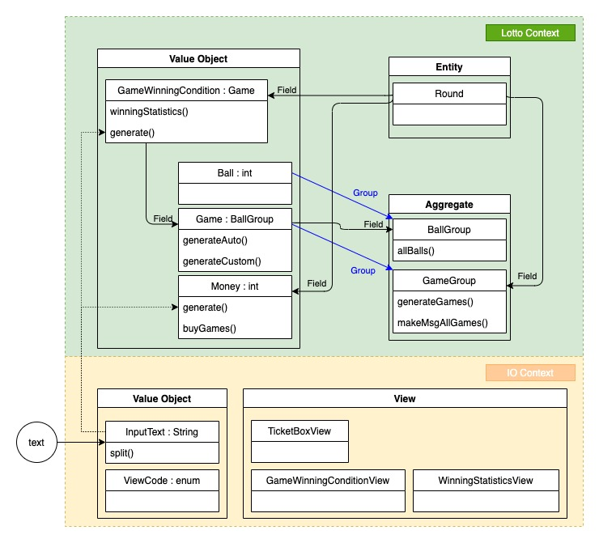

# 3단계 - 로또(자동)
## 1. 요구사항 정의
### 1.1. 명시된 요구사항
#### 1.1.1. 요구사항
- 로또 구입 금액을 입력하면 구입 금액에 해당하는 로또를 발급해야 한다. 
- 로또 1장의 가격은 1000원이다.

#### 1.1.2. 힌트
- 로또 자동 생성은 `Collections.shuffle()` 메소드 활용한다.
- `Collections.sort()` 메소드를 활용해 정렬 가능하다.
- `ArrayList`의 `contains()` 메소드를 활용하면 어떤 값이 존재하는지 유무를 판단할 수 있다.

#### 1.1.3. 실행 결과
```
구입금액을 입력해 주세요.
14000
14개를 구매했습니다.
[8, 21, 23, 41, 42, 43]
[3, 5, 11, 16, 32, 38]
[7, 11, 16, 35, 36, 44]
[1, 8, 11, 31, 41, 42]
[13, 14, 16, 38, 42, 45]
[7, 11, 30, 40, 42, 43]
[2, 13, 22, 32, 38, 45]
[23, 25, 33, 36, 39, 41]
[1, 3, 5, 14, 22, 45]
[5, 9, 38, 41, 43, 44]
[2, 8, 9, 18, 19, 21]
[13, 14, 18, 21, 23, 35]
[17, 21, 29, 37, 42, 45]
[3, 8, 27, 30, 35, 44]

지난 주 당첨 번호를 입력해 주세요.
1, 2, 3, 4, 5, 6

당첨 통계
---------
3개 일치 (5000원)- 1개
4개 일치 (50000원)- 0개
5개 일치 (1500000원)- 0개
6개 일치 (2000000000원)- 0개
총 수익률은 0.35입니다.(기준이 1이기 때문에 결과적으로 손해라는 의미임)
```

### 1.2. 기능 요구사항 정리
|구분 | 상세 |구현방법     |
|:----:  |:------  |:---------|
|로또 구매|• 구매 금액 입력 요청 메시지 출력|• "구매금액을 입력해 주세요." 출력<br>• 입력 대기|
|로또 구매|• 구매 금액 입력|• 숫자만 입력할 수 있도록 한다. => 잘못된 양식으로 입력된 경우 재입력 시도요청|
|로또 구매|• 구매한 로또 개수 출력|• "n개를 구매했습니다."<br>• 구매한 로또 게임의 개수를 출력한다.<br>• 로또의 게임 당 오름차순으로 정렬된 값으로 보여준다.(각 게임 간 정렬은 하지 않는다.)|
|당첨 번호 입력|• 지난 주 당첨 번호 입력 요청 메시지 출력|• "지난 주 당첨 번호를 입력해 주세요." 출력<br>• 구분자는 `,(comma)`를 사용한다.<br>• 다음의 조건을 만족하지 않는 경우 재입력 요청<br>&nbsp;&nbsp;&nbsp;1.`1~45` 사이의 자연수<br>&nbsp;&nbsp;&nbsp;2. 겹치지 않는 서로 다른 숫자 6개 조합|
|당첨 통계 출력|• 지난 주 당첨 번호와 각 게임마다 일치한 숫자의 개수를 출력|• 표출된 전체 개수는 구매한 로또 게임 개수 이하 이다.|
|당첨 통계 출력|• 총 수익률을 계산하여 출력한다.|• 수익률을 출력한다.<br>• 소수점 3자리 이하는 버린다.<br>• 손익에 따라 다음과 같이 출력한다.<br>&nbsp;&nbsp;&nbsp;`손해` : (기준이 1이기 때문에 결과적으로 손해라는 의미임)<br>&nbsp;&nbsp;&nbsp;`이익` : (축하합니다. 구입금액 대비 xxx% 수익이 생겼습니다.)

### 1.3. 프로그래밍 요구사항
|구분|상세|구현 방법|
|:---:|:---|---|
|Convention|• 자바 코드 컨벤션을 지키면서 프로그래밍한다.<br>&nbsp;&nbsp;• https://naver.github.io/hackday-conventions-java/ <br>&nbsp;&nbsp;• https://google.github.io/styleguide/javaguide.html <br>&nbsp;&nbsp;•  https://myeonguni.tistory.com/1596 |- gradle-editorconfig 적용<br>- gradle-checkstyle 적용<br>- IntelliJ 적용<br>- Github 적용|
|메소드|• indent(인덴트, 들여쓰기) depth를 2가 넘지 않도록 구현한다. 1까지만 허용한다.<br>&nbsp;&nbsp;• 예를 들어 while문 안에 if문이 있으면 들여쓰기는 2이다.<br>&nbsp;&nbsp;• **힌트: indent(인덴트, 들여쓰기) depth를 줄이는 좋은 방법은 함수(또는 메소드)를 분리**하면 된다.|- < 2depth 규칙|
|메소드|• 함수(또는 메소드)의 길이가 15라인을 넘어가지 않도록 구현한다.<br>&nbsp;&nbsp;• 함수(또는 메소드)가 한 가지 일만 잘 하도록 구현한다.|- 함수(또는 메서드) 15라인 이하|
|메소드|• else 예약어를 쓰지 않는다.<br>&nbsp;&nbsp;• 힌트: if 조건절에서 값을 return하는 방식으로 구현하면 else를 사용하지 않아도 된다.<br>&nbsp;&nbsp;• else를 쓰지 말라고 하니 switch/case로 구현하는 경우가 있는데 switch/case도 허용하지 않는다.|- else 예약어 금지|
|테스트|• 모든 기능을 TDD로 구현해 단위 테스트가 존재해야 한다. 단, UI(System.out, System.in) 로직은 제외<br>&nbsp;&nbsp;• 핵심 로직을 구현하는 코드와 UI를 담당하는 로직을 구분한다.<br>&nbsp;&nbsp;•UI 로직을 InputView, ResultView와 같은 클래스를 추가해 분리한다.|- 핵심 로직 단위테스트|
|테스트|• 모든 로직에 단위 테스트를 구현한다. 단, UI(System.out, System.in) 로직은 제외 <br>&nbsp;&nbsp;• 핵심 로직을 구현하는 코드와 UI를 담당하는 로직을 구분한다.<br>&nbsp;&nbsp;• UI 로직을 InputView, ResultView와 같은 클래스를 추가해 분리한다.|- 핵심 로직 단위테스트|

### 1.4. 비기능 요구사항
|구분 |상세 |구현방법     |
|:----:  |:------  |:---------|
|요구사항|• 기능을 구현하기 전에 README.md 파일에 구현할 기능 목록을 정리해 추가한다.|- 요구사항 정의 정리|
|Convention|• git의 commit 단위는 앞 단계에서 README.md 파일에 정리한 기능 목록 단위로 추가한다.<br>&nbsp;&nbsp;• 참고문서 : [AngularJS Commit Message Conventions](https://gist.github.com/stephenparish/9941e89d80e2bc58a153)|- git commit 시 해당 convention 적용|
|인수인계|• **_1.4.2. 코드리뷰 요청 및 피드백_** 을 참조|- step 실행 후 진행|
|인수인계|• **_1.4.3. 다음 단계 미션 진행을 위한 준비_** 을 참조|- step 시작 전 진행|

#### 1.4.1. AngularJS Commit Message Conventions 중
- commit message 종류를 다음과 같이 구분
```
feat (feature)
 fix (bug fix)
 docs (documentation)
 style (formatting, missing semi colons, …)
 refactor
 test (when adding missing tests)
 chore (maintain)
 ```

#### 1.4.2. 코드리뷰 요청 및 피드백
- 실습을 끝내면 [코드 리뷰 1단계](https://github.com/next-step/nextstep-docs/blob/master/codereview/review-step1.md) 문서의 7단계, 8단계를 참고해 자신의 저장소에 push한다.
- 온라인 코드리뷰 요청 1단계 동영상<br>
  [](https://www.youtube.com/watch?v=YkgBUt7zG5k)

- 코드 리뷰 2단계 문서를 참고해 코드 리뷰 요청(pull request)을 보내고, NextStep 우측 상단의 Github 아이콘을 클릭해 리뷰 요청을 보낸다.
- 피드백 또는 merge 될 때까지 기다린다.
> PR에 대한 수정 요청을 받아 코드를 수정하는 경우 새로운 PR을 보낼 필요가 없다.<br>
코드를 수정한 후 add/commit/push만 하면 자동으로 해당 PR에 추가된다.

- 온라인 코드리뷰 요청 2단계 동영상<br>
  [](https://www.youtube.com/watch?v=HnTdFJd0PtU)
  <br>

#### 1.4.3. 다음 단계 미션 진행을 위한 준비
- Slack을 통해 merge가 되는지 확인한 후에 [코드 리뷰 3단계](https://github.com/next-step/nextstep-docs/blob/master/codereview/review-step3.md) 과정으로 다음 단계 미션을 진행한다.
- 온라인 코드리뷰 요청 3단계 동영상<br>
  [](https://www.youtube.com/watch?v=fzrT3eoecUw)
  <br>

## 2. 분석 및 설계
### 2.1. 이번 Step 핵심 목표
#### 2.1.1. TDD (Test-Driven Developmet) : production code보다 test code를 먼저 작성한다.
> Cycle : Test Fail ---> Test Passes ---> Refactor ---> Test Fail ---> ...
#### 2.1.2. Getter, Setter를 쓰지 않는다.
- Getter, Setter (x)
```java
/**
 * Getter, Setter 사용
 */
public class Number {
  private int number;                                             //값이 오염될 수 있다.
  
  public int getNumber() { return this.number; }                  //사용금지
  public void setNumber(int number) { this.number = number; }     //사용금지
}
```
```java
/**
 * Constructor, 직관적인 명시 사용
 */
public class Number {
  private final int value;                             //값의 불변을 지켜주도록 함

  public Number(int number) { this.number = number; }  //생성자로 대체
  
  public int value() { return this.number; }           //직관적인 VO는 value, Entity는 number로 사용한다. 
}
```

> :question: 이를 연습하는 이유?!.
> 
>> :bulb: DDD(Domain-Driven Design, 도메인 주도 설계)를 이해하면 도움이 된다.
>> 
>> 참고자료 : 도메인 주도 설계 철저 입문(나루세 마사노부, 위키북스)
>>> :exclamation: :exclamation: :exclamation: 현재 학습 중인 내용으로 DDD와 관계된 내용들이 정확하지 않을 수 있습니다. 아래 내용에 맹신하시지 마시길 바랍니다.
>
> 1.값 객채(VO, Value Object)
> 1. 값 객체의 성질
> - 값의 불변성 : 값을 변화하지 않는 성질을 갖는다.
>   - :exclamation: 따라서 `setter`를 사용하지 않는다.
> ```java
> //값의 불변성이 지켜지지 않은 VO
> Number three = new Number(3);
> System.out.println(three.getNumber());  //3
> Number two = three;
> two.setNumber(2);                       //도메인 주도 설계에서는 이런 메소드는 설정하지 않는다.
> System.out.println(two.getNumber());    //2
> System.out.println(three.getNumber());  //2 -> 이와 같이 값이 변경되는 경우가 생긴다.
> ```
> ```java
> //값의 불변성 VO
> Number three = new Number(3);
> System.out.println(three.value());  //3
> Number two = new Number(2);
> System.out.println(two.value());    //2
> System.out.println(three.value());  //3 -> 이와 같이 값이 오염되는 것을 방지할 수 있다.
> ```
> - 교환 가능하다. : 새로운 값으로 대체된다.
>   - :exclamation: 값 객체의 수정이 필요한 경우 **새로운 값 객체를 생성**하여 대체한다.
> ```java
> Number twoOtThree = new Number(3);
> System.out.println(twoOtThree.value());  //3
> twoOtThree = new Number(2);
> System.out.println(twoOtThree.value());  //2
> ```
> - 등가성 비교 가능 : 같은 값인지 비교할 수 있어야 한다.
>   - :exclamation: 값 객체에 `equals`메소드를 정의하면, 도메인에 따른 코드의 수정 난이도를 감소할 수 있다.
> ```java
> //이렇게 작성하면 비교하는 지점마다 수정을 해줘야한다. 즉, 수정 난이도가 급격히 상승한다.
> Number three = new Number(3);
> Number two = new Number(2);
> three.value() == two.value();  //false
> ```
> ```java
> //비교를 도메인 객체에 위임함으로써 관리 포인트가 현격히 감소한다.
> Number three = new Number(3);
> Number two = new Number(2);
> three.equals(two);             //false
> ```
> 2. 값 객체의 기준
>> :exclamation: 매우 상대적인 기준이 되므로 선정함에 주의를 기울여야 한다.
>> 책의 저자도 **_개인적인 기준_** 을 언급하면서 정확한 정의를 내리지 않았다.
> - 규칙이 존재하는가.
>> eg1. 성명을 성과 이름을 구분해야하는 규칙이 있는 경우 : LastName(VO), FirstName(VO)를 생성하고, 이 둘을 필드 값으로 갖는 FullName(VO)를 생성.
>> <br>eg2. 성명에 대한 규칙이 없음 : Name(VO)를 생성.
> - 낱개로 다루어야 하는가.
>> eg. LastName(VO), FirstName(VO) 처럼 값 객체 내 필드를 1개를 두고 사용할 것인지 FullName(VO)처럼 2개 이상 필드를 두고 사용할 것인지.
>
> 3. 행동이 정의된 값 객체
> ```java
> class Money {
>   private final double amount;
>   private final String currency;
> 
>   public Money(double amount, String currency) throws IllegalArgumentException {
>     if (currency == null) {
>       throw new IllegalArgumentException("화폐 단위는 필수 값입니다.");
>     }
>     this.amount = amount;
>     this.currency = currency; 
>   }
> 
>   public double amount() { return this.amount; }
>   public String currency() { return this.currency; }
> 
>   public Money add(Money arg) throws IllegalArgumentException {
>     if (arg == null) {
>       throw new IllegalArgumentException("Argument 중 Null이 존재하여 add()를 수행할 수 없습니다.");
>     }
>     if (currency != arg.currency()) {
>       throw new IllegalArgumentException("화폐 단위가 다릅니다. this:"+currency+", arg:"+arg.currency());
>     }
>     return new Money(amount + arg.amount(), currency);
>   }
> 
>   public Money multiply(Rate rate) throws IllegalArgumentException {
>     if (rate == null) {
>       throw new IllegalArgumentException("Argument 중 Null이 존재하여 multiply()를 수행할 수 없습니다.");
>     }
>     return new Money(amount * rate.value(), currency);
>   }
> }
> ```
> - 정의 되었기에 알 수 있는 것
>   - 같은 화폐에서만 덧셈이 가능하다.
>   - 돈을 곱할 수 있는 것은 `Rate`만 가능하다.
> - 정의되지 않았기에 알 수 있는 것
>   - 돈끼리 덧셈은 가능하지만 곱셈은 불가능하다.
>
> 4. 값 객체의 장점
> - 표현력이 증가한다.
> ```java
> String modelNumber = "a20421-100-1";      //모델 넘버가 3가지로 구분된다는 것을 알 수 있으나 상세한 내용을 모른다.
> void method(String modelNumber) { ... }   //위 값이 없었다면 문자열이라는 정보만 알 수 있다.
> ```
> ```java
> class ModelNumber {
>   private final String productCode;
>   private final String branch;
>   private final String lot;
>   ...
>   @Override
>   public String toString() {
>     return productCode + "-" + branch + "-" + lot;
>   }
> }
> 
> void method(ModelNumber modelNumber) { ... } //위 정보만 봐도 모델넘버가 3가지의 어떤 값을 가지고 있는지 정보를 획득할 수 있다.
> ```
> - 무결성이 유지된다.
> ```java
> int score = 80;   //현재 점수의 유효범위를 알 수 없다.
> ```
> ```java
> class TOEICScore {
>   private static final int MAX_SCORE = 990;
>   private final int value;
> 
>   public Score(int score) throws {
>     if (MAX_SCORE < score) {
>       throw new IllegalArgumentException("최고 점수는 "+MAX_SCORE+"입니다. 입력값 : "+score);
>     }
>     this.value = score;
>   }
> }
> 
> TOEICScore score = new TOEICScore(999);   //IllegalArgumentException이 발생한다.
> ```
> - 잘못된 대입을 방지한다.
> ```java
> //원시 값으로 다룰 경우 다음과 같은 상황이 발생할 수 있다.
> class FullName {
>   private final String firstName;
>   private final String lastName;
> 
>   public FullName(String firstName, String lastName) {
>     this.firstName = firstName;
>     this.lastName = lastName;
>   }
>   ...
> }
> 
> String engName = "Gregory Lee";
> String korName = "Lee Jaeyoung";
> 
> String[] splitEngName = engName.split(" ");
> String[] splitKorName = korName.split(" ");
> 
> FullName engFullName = new FullName(splitEngName[0], splitEngName[1]); //firstName : Grogory, lastName : Lee
> FullName korFullName = new FullName(splitKorName[0], splitKorName[1]); //firstName : Lee (?), lastName : Jaeyoung (?)
> ```
> ```java
> //값 객체를 활용하여 생성자 사용 시 컴파일 에러가 나오면 잘못된 대입을 막을 수 있다.
> class FullName {
>   private final FirstName firstName;
>   private final LastName lastName;
> 
>   public FullName(FirstName firstName, LastName lastName) {
>     this.firstName = firstName;
>     this.lastName = lastName;
>   }
>   ...
> }
> ```
> - 로직이 코드 이곳저곳에 흩어지는 것을 방지한다.
> ```java
> class TOEICScore {
>   private static final int MAX_SCORE = 1500; //토익 정책이 변경되어 최고 점수가 바뀌면 해당 부분만 바꿔주면 된다.
>   private final int value;
> 
>   public Score(int score) throws {
>     if (MAX_SCORE < score) {
>       throw new IllegalArgumentException("최고 점수는 "+MAX_SCORE+"입니다. 입력값 : "+score);
>     }
>     this.value = score;
>   }
> }
> 
> TOEICScore score = new TOEICScore(999);   //정상적으로 값 객체가 생성된다.
> ```

### 2.2. Todo List
- [x] 0.기본 세팅
    - [x] 0-1.git fork/clone
    - [x] 0-2.요구사항 정리
    - [x] 0-3.[AngularJS Commit Message Conventions](https://gist.github.com/stephenparish/9941e89d80e2bc58a153#generating-changelogmd) 참고
    - [x] 0-4.Slack을 통해 merge가 되는지 확인한 후에 코드 리뷰 3단계 과정으로 다음 단계 미션을 진행
        - [x] 0-4-1.gregolee(master) branch로 체크아웃 : `git checkout gregolee`
        - [x] 0-4-2.step2 branch 삭제 : `git branch -D step2`
        - [x] 0-4-3.step2 branch 삭제 확인 : `git branch -a`
        - [x] 0-4-4.원본(next-step) git repository를 remote로 연결 (미션 당 1회) : `git remote add -t gregolee upstream https://github.com/next-step/java-lotto`
        - [x] 0-4-5.원본(next-step) git repository를 remote로 연결 확인 : `git remote -v`
        - [x] 0-4-6.원본(next-step) git repository에서 merge된 나의 branch(gregolee)를 fetch : `git fetch upstream gregolee`
        - [x] 0-4-7.remote에서 가져온 나의 branch로 rebase : `git rebase upstream/gregolee`
        - [x] 0-4-7.gregolee -> step3로 체크아웃 : `git checkout -b step3`
    - [x] 0-5.리뷰어님의 리뷰를 반영한 코드로 수정
        - [x] 0-5-1.테스트 코드 `given`, `when`, `then` 적용
        - [x] 0-5-2.`Pattern` 초기화 시에만 `compile`
        - [x] 0-5-3.매직넘버 추출 : src/main/java/study/step2/StringAddCalculator.java, src/main/java/study/step2/domain/value/Number.java
        - [x] 0-5-4.`is~`, `validate~` 구분하여 명칭 작성 : src/main/java/study/step2/StringAddCalculator.java 
        - [x] 0-5-5.불변객체로 선언 [[참고자료]](https://os94.tistory.com/153) : src/main/java/study/step2/StringAddCalculator.java 
- [x] 1.자바 코드 컨벤션을 위한 세팅
    - [x] 1-1.[gradle-editorconfig](https://naver.github.io/hackday-conventions-java/#editorconfig) 적용
    - [x] 1-2.[gradle-checkstyle](https://naver.github.io/hackday-conventions-java/#checkstyle) 적용
    - [x] 1-3.[IntelliJ](https://naver.github.io/hackday-conventions-java/#_intellij) 적용
    - [x] 1-4.[Github](https://naver.github.io/hackday-conventions-java/#_github) 적용
- [x] 2.학습
    - [x] 2-1.[온라인 코드리뷰 요청 1단계 동영상](https://www.youtube.com/watch?v=YkgBUt7zG5k)
    - [x] 2-2.[온라인 코드리뷰 요청 2단계 동영상](https://www.youtube.com/watch?v=HnTdFJd0PtU)
    - [x] 2-3.[온라인 코드리뷰 요청 3단계 동영상](https://www.youtube.com/watch?v=fzrT3eoecUw)
- [x] 3.분석 및 설계
    - [x] 3-1.Step03.md 작성
    - [x] 3-2.도메인 주도 설계 이미지 작성
- [ ] 4.구현
    - [x] 4-1.Lotto Context
        - [x] 4-1-1.도메인 주도 설계 이미지 작성
        - [x] 4-1-2.`Value Object` & `Aggregate`
            - [x] 4-1-2-1.`Ball(VO)`
                - [x] 4-1-2-1-1.`validate()` : 1~45의 자연수 유효성 체크
                - [x] 4-1-2-1-2.`generate()` : Ball 생성
                - [x] 4-1-2-1-3.`equals()` : 등가성 비교
            - [x] 4-1-2-2.`BallGroup(Aggregate)`
                - [x] 4-1-2-2-1.`generate()` : 입력된 정보를 토대로 BallGroup을 생성한다.
                - [x] 4-1-2-2-2.`allOfBalls()` : 모든 볼의 정보를 초기화하여 static 영역에 가지고 있는다.
            - [x] 4-1-2-3.`Game(VO)`
                - [x] 4-1-2-3-1.`generateAuto()` - 시도 횟수 : 100회, 경우의 수 : 2179827, 테스트 실패 확률 : 약0.00459%
                - [x] 4-1-2-3-2.`generateCustom()` : 모든 볼의 정보를 토대로 게임을 수동으로 생성한다.
                - [x] 4-1-2-3-3.`equals()` : 등가성 비교
            - [x] 4-1-2-4.`GameGroup(Aggregate)`
                - [x] 4-1-2-4-1.`buyGames()` : 금액에 따라 여러 개의 게임을 생성한다.
                - [x] 4-1-2-4-2.`makeMsgAllGames()` : 모든 게임의 정보를 메시지로 작성한다.
            - [x] 4-1-2-5.`GameWinningCondition(VO)`
                - [x] 4-1-2-5-1.`generate()` : 게임 당첨 조건을 생성한다.
                - [x] 4-1-2-5-2.`calculateContainWinningBalls()` : 게임 등수를 계산한다.
                - [x] 4-1-2-5-3.`makeMsgWinningStatistics()` : 당첨 통계를 생성한다.
                - [x] 4-1-2-5-4.`equals()` : 같은 게임 승리 조건인지 판별한다.
            - [x] 4-1-2-6.`Money(VO)`
                - [x] 4-1-2-6-1.`validate()` : 돈 유효성 체크(0 이상)
                - [x] 4-1-2-6-2.`generate()` : 돈 생성
                - [x] 4-1-2-6-3.`countOfGames()` : 입력된 금액에서 구매할 수 있는 게임의 수
            - [x] 4-1-2-7.`PrizeCode(VO)`
                - [x] 4-1-2-7-1.`is~()` : 등가성 비교
                - [x] 4-1-2-7-2.`getCode()` : 코드 값 구하기  
        - [x] 4-1-3.`Entity`
            - [x] 4-1-3-1.`Round`
                - [x] 4-1-3-1-1.Field 생성 : `GameWinningCondition`, `GameGroup`, `Money`
    - [x] 4-2.IO Context
        - [x] 4-2-1.`Value Object` & `Aggregate`
            - [x] 4-2-1-1.`InputText(VO)`
                - [x] 4-2-1-1-1.`validate()` : `null`, `empty`의 경우 exception 발생
                - [x] 4-2-1-1-2.`generate()` : `null`, `empty`의 경우 exception 발생
                - [x] 4-2-1-1-3.`splitByComma()` : 쉼표`,`를 구분자로 사용한다. `trim()`을 활용하여 공백을 제거한 InputText의 리스트로 리턴한다.
            - [x] 4-2-1-2.`InputTextGroup(Aggregate)`
                - [x] 4-2-1-2-1.`generate()` : InputTextGroup를 생성한다.
            - [x] 4-2-1-3.`ViewCode(VO)`
                - [x] 4-2-1-3-1.`is~()` : 등가성 비교
            - [x] 4-2-1-4.`ProcessCode(VO)`
                - [x] 4-2-1-4-1.`is~()` : 등가성 비교 
        - [x] 4-2-2.View
            - [x] 4-2-2-1.`TicketBoxView`
            - [x] 4-2-2-2.`GameWinningConditionView`
            - [x] 4-2-2-3.`WinningStaticsView`
    - [x] 4-3.Refactoring
        - [x] 4-3-1.각 VO, Entity, Aggregate에 맞는 메서드가 작성되었는가 확인
        - [x] 4-3-2.메서드 명이 충분히 적절하게 작성된 명칭인가 확인
        - [x] 4-3-3.Context별 상위 Exception 생성
- [ ] 5.테스트
    - [ ] 5-1.Gradle build Success 확인
        - [ ] 5-1-1.`Value Object` & `Aggregate`
            - [ ] 5-1-1-1.`Ball(VO)`
            - [ ] 5-1-1-2.`BallGroup(Aggregate)`
            - [ ] 5-1-1-3.`Game(VO)`
            - [ ] 5-1-1-4.`GameGroup(Aggregate)`
            - [ ] 5-1-1-5.`GameWinningCondition(VO)`
            - [ ] 5-1-1-6.`Money(VO)`
            - [ ] 5-1-1-7.`InputText(VO)`
            - [ ] 5-1-1-8.`ViewCode(VO)`
      - [ ] 5-1-2.`Entity`
            - [ ] 5-1-2-1.`Round`
    - [ ] 5-2.checkstyle 문제없는지 확인 (Java Convention)
    - [ ] 5-3.요구사항 조건들 충족했는지 확인
        - [ ] 5-3-1.< 2 Depth 규칙
        - [ ] 5-3-2.함수(또는 메서드) 15라인 이하
        - [ ] 5-3-3.else 예약어 금지
- [ ] 6.인수인계
    - [ ] 6-1.소감 및 피드백 정리
        - [ ] 6-1-1.느낀점 & 배운점 작성
        - [ ] 6-1-2.피드백 요청 정리
    - [ ] 6-2.코드리뷰 요청 및 피드백
        - [ ] 6-1-1.step3를 gregolee/java-lotto로 push : `git push origin step3`
        - [ ] 6-1-2.pull request(PR) 작성
    - [ ] 6-3.Slack을 통해 merge가 되는지 확인한 후에 코드 리뷰 3단계 과정으로 다음 단계 미션을 진행

### 2.3. 설계
#### 2.3.1. Domain-Driven-Design (DDD)


## 3. 인수인계
### 3.1. 느낀점 & 배운점
#### 3.1.1. 느낀점
- DDD 실천은 정말 어려웠습니다.
  - 컨텍스트가 다른 하나로 분리가 되고, 도메인 객체, 엔티티가 몇개가 되지 않음에도 상당히 복잡하고 난이도가 급상승했습니다.
  - TDD에 잘 맞춰진 설계인 DDD를 해보는 것이 아니라, DDD를 위해서 TDD를 충실히 해야됨을 느꼈습니다.
  - 세세한 메서드까지 설계를 하기엔 양이 방대하기 때문에 한번에 완성도 있는 설계를 하지 않도록 노력했습니다. 그러나 쉽지 않았습니다.
  - 기본적인 메서드(객체 생성, 값 조회, 값 수정 등)는 굳이 설계에서 필요하겠냐 싶어서 제외했는데, 테스트에서 막혀서 다시 롤백하는 상황이 빈번했습니다.
  - 이론도 상당히 많이 필요로 했지만, 이론 못지 않게 토이프로젝트를 통해서 경험을 축적해야 될 것 같다고 생각합니다.
- TDD & DDD 실무 적용기
  - 하나의 Entity에 값 객체가 34개에 달하는 RESTful API Method를 하나 작성하는데 1주일 이상 소요되었습니다.
  - 값 객체 하나하나의 TDD를 하는데, 3개쯤하다가 좋은 아이디어가 생각나서 롤백, 5개쯤하다가 롤백, 10개쯤...하다가 지쳤습니다. 체력이 아니라 정신력의 싸움이었습니다.
  - 놀라웠던 경험은 Exception 관리할때 정말 편했습니다. 
    - json으로 전달받은 값들이 유효한 값인지 관리하는데, 정말 편리했습니다.
    - 기존 Exception처리는 미봉책으로 작성하여 허술한 부분이 많았고, 부족한 설명으로 사용자에게 친화적이지 않았습니다.
    - '여긴 빈틈이 있겠지?!'하는 부분을 TDD에서 충분히 메워줌으로써 코드 품질이 조금이나마 향상된 것이 너무 좋았습니다.
    
#### 3.1.2. 배운점
- Getter, Setter를 버리고...
  - 과거 : 개발하고, 프로젝트 마무리할때 주석 달고, 기억에서 잊힐때쯤 다시 번역&해석&해독의 반복 과정 
    - 과거는 정말 비효율적이었습니다. 주석이 반드시 존재해야 메서드를 읽을 수 있었고, 주석을 읽어도 메서드를 이해하지 못하는 경우가 많았습니다. 
    - 특히 메서드를 작성한 후 기억에서 가물가물해질때 즈음 주석 작성은 정말 고통이었습니다.
    - primitive value, String에 적힌 이름은 너무 단순하여 값을 `읽는 것`이 아닌 `추론`을 해야 하는 경우가 많았습니다.
  - 장점 : 더 좋은 `네이밍`에 고민을 할 수 있었습니다. 주석이 없어도 코드로 읽히는 내용. +알파 **_영단어 학습 기회 획득!!!_** 
    - 오히려 메서드의 명칭을 읽고, 리턴 데이터 타입을 읽으니 `1.어떤 파라메터를 던지면, 2.이러한 데이터타입을 리턴하는 메서드구나.`라는 것을 쉽게 이해할 수 있었습니다.
    - 네이밍이 긴 것이 가독성을 떨어뜨리는 것이 아닌, 함축하여 적은 네이밍이 오히려 이해의 흐름을 끊는 `독`이었음을 깨달았습니다.
  - 단점 : Lombok을 쓰지 않아서 타이핑 연습을 많이 합니다. IDE가 Getter, Setter를 자동 지원하려고 해서 불편합니다.

### 3.2. 피드백 요청
- 오버엔지니어링?! 
  - 현재 3단계를 진행하면서 5일 가량을 했습니다...너무 어렵게 생각한 것이 아닌가 리뷰어님께 자문을 구합니다.
    - 컨텍스트의 구분이 적절했는지?
    - 도메인 객체(VO, Entity), 일급컬렉션의 구분이 적절했는지?
    - 그 외 리뷰어님께서 보시기에 조언을 해주고 싶은 부분이 있다면 말씀 부탁드립니다.
- 엔티티에 대하여...      
  - Round를 Entity로 사용, 여러 메서드를 거치면서 값이 변질되었습니다. 이렇게 메서드를 거치다보면 `오염`되는 경우가 많은데 괜찮은지 여쭤봅니다.
    - `TicketBoxView`에서 금액을 입력하면 필드에 저장되고, `GameWinningConditionView`에서 당첨 번호를 입력하면 당첨 번호를 필드에 저장합니다.
    - 이런 과정을 거치면서 어느 시점에 필드가 저장된 것인지 알 수 없어 `NullPointerException`이 종종 발생했습니다.
    - 위와 같은 예에서 방어적인 프로그래밍 측면으로 무엇을 하는 것이 이상적인지 여쭤봅니다.
