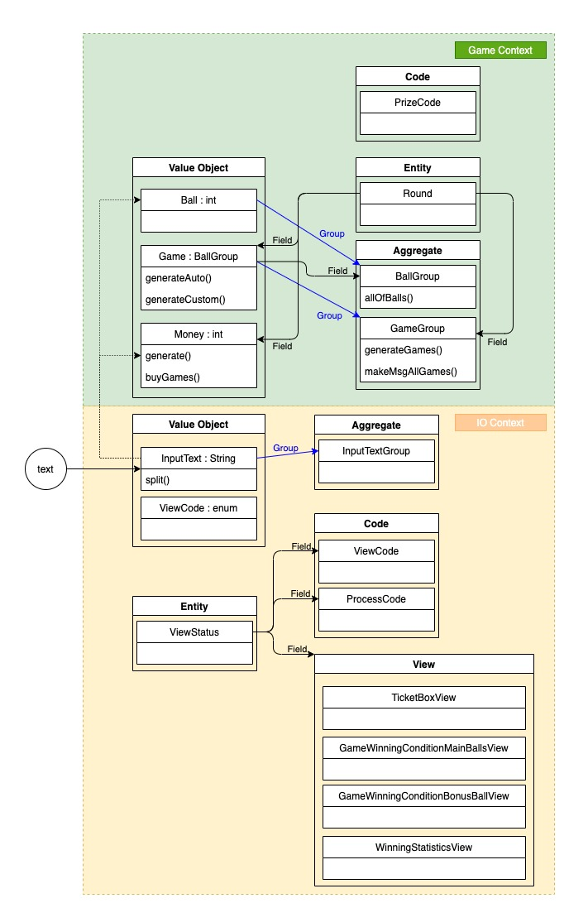

# 4단계 - 로또(2등)

## 1. 요구사항 정의

### 1.1. 명시된 요구사항

#### 1.1.1. 요구사항

- 2등을 위해 추가 번호를 하나 더 추첨한다.
- 당첨 통계에 2등도 추가해야 한다.

#### 1.1.2. 힌트

- 일급 콜렉션을 쓴다.
    - 6개의 숫자 값을 가지는 java collection을 감싸는 객체를 추가해 구현해 본다.
- 하드 코딩을 하지 않기 위해 상수 값을 사용하면 많은 상수 값이 발생한다. 자바의 enum을 활용해 상수 값을 제거한다. 즉, enum을 활용해 일치하는 수를 로또 등수로 변경해 본다.

```java
public enum Rank {
    FIRST(6, 2_000_000_000),
    SECOND(5, 30_000_000),
    THIRD(5, 1_500_000),
    FOURTH(4, 50_000),
    FIFTH(3, 5_000),
    MISS(0, 0);

    private int countOfMatch;
    private int winningMoney;

    private Rank(int countOfMatch, int winningMoney) {
        this.countOfMatch = countOfMatch;
        this.winningMoney = winningMoney;
    }

    public int getCountOfMatch() {
        return countOfMatch;
    }

    public int getWinningMoney() {
        return winningMoney;
    }

    public static Rank valueOf(int countOfMatch, boolean matchBonus) {
        // TODO 일치하는 수를 로또 등수로 변경한다. enum 값 목록은 "Rank[] ranks = values();"와 같이 가져올 수 있다.
        return null;
    }
}
```

#### 1.1.3. 실행 결과

```
[... 생략 ...]

지난 주 당첨 번호를 입력해 주세요.
1, 2, 3, 4, 5, 6
보너스 볼을 입력해 주세요.
7

당첨 통계
---------
3개 일치 (5000원)- 1개
4개 일치 (50000원)- 0개
5개 일치 (1500000원)- 0개
5개 일치, 보너스 볼 일치(30000000원) - 0개
6개 일치 (2000000000원)- 0개
총 수익률은 0.35입니다.(기준이 1이기 때문에 결과적으로 손해라는 의미임)
```

### 1.2. 기능 요구사항 정리

|구분 | 상세 |구현방법     |
|:----:  |:------  |:---------|
|당첨 번호 입력|• 지난 주 당첨 번호 입력 요청 메시지 출력|• "지난 주 당첨 번호를 입력해 주세요." 출력<br>• 구분자는 `,(comma)`를 사용한다.<br>• 다음의 조건을 만족하지 않는 경우 재입력 요청<br>&nbsp;&nbsp;&nbsp;1.`1~45` 사이의 자연수<br>&nbsp;&nbsp;&nbsp;2. 겹치지 않는 서로 다른 숫자 6개 조합|
|당첨 번호 입력 (보너스볼)|• 보너스 볼 입력 요청 메시지 출력|• "보너스 볼을 입력해 주세요." 출력<br>• 하나의 숫자만 입력한다.<br>• 다음의 조건을 만족하지 않는 경우 재입력 요청<br>&nbsp;&nbsp;&nbsp;1.`1~45` 사이의 자연수<br>&nbsp;&nbsp;&nbsp;2. 당첨 번호 6개 중 일치하는 숫자|
|당첨 통계 출력|• 지난 주 당첨 번호와 보너스 번호 조합이 일치한 게임의 개수를 출력|• 표출된 전체 개수는 구매한 로또 게임 개수 이하 이다.|
|당첨 통계 출력|• 총 수익률을 계산하여 출력한다.|• 수익률을 출력한다.<br>• 소수점 3자리 이하는 버린다.<br>• 손익에 따라 다음과 같이 출력한다.<br>&nbsp;&nbsp;&nbsp;`손해` : (기준이 1이기 때문에 결과적으로 손해라는 의미임)<br>&nbsp;&nbsp;&nbsp;`이익` : (축하합니다. 구입금액 대비 xxx% 수익이 생겼습니다.)

### 1.3. 프로그래밍 요구사항

|구분|상세|구현 방법|
|:---:|:---|---|
|Convention|• 자바 코드 컨벤션을 지키면서 프로그래밍한다.<br>&nbsp;&nbsp;• https://naver.github.io/hackday-conventions-java/ <br>&nbsp;&nbsp;• https://google.github.io/styleguide/javaguide.html <br>&nbsp;&nbsp;•  https://myeonguni.tistory.com/1596 |- gradle-editorconfig 적용<br>- gradle-checkstyle 적용<br>- IntelliJ 적용<br>- Github 적용|
|enum|• java enum을 적용해 프로그래밍을 구현한다.|• Code값들은 enum을 활용하여 구현한다.|
|일급 콜렉션|• 규칙 8: 일급 콜렉션을 쓴다.|• 값 객체(VO) 또는 엔티티(Entity)의 Collection을 일급 콜렉션으로 구현한다.|
|메소드|• indent(인덴트, 들여쓰기) depth를 2가 넘지 않도록 구현한다. 1까지만 허용한다.<br>&nbsp;&nbsp;• 예를 들어 while문 안에 if문이 있으면 들여쓰기는 2이다.<br>&nbsp;&nbsp;• **힌트: indent(인덴트, 들여쓰기) depth를 줄이는 좋은 방법은 함수(또는 메소드)를 분리**하면 된다.|- < 2depth 규칙|
|메소드|• 함수(또는 메소드)의 길이가 15라인을 넘어가지 않도록 구현한다.<br>&nbsp;&nbsp;• 함수(또는 메소드)가 한 가지 일만 잘 하도록 구현한다.|- 함수(또는 메서드) 15라인 이하|
|메소드|• else 예약어를 쓰지 않는다.<br>&nbsp;&nbsp;• 힌트: if 조건절에서 값을 return하는 방식으로 구현하면 else를 사용하지 않아도 된다.<br>&nbsp;&nbsp;• else를 쓰지 말라고 하니 switch/case로 구현하는 경우가 있는데 switch/case도 허용하지 않는다.|- else 예약어 금지|
|테스트|• 모든 기능을 TDD로 구현해 단위 테스트가 존재해야 한다. 단, UI(System.out, System.in) 로직은 제외<br>&nbsp;&nbsp;• 핵심 로직을 구현하는 코드와 UI를 담당하는 로직을 구분한다.<br>&nbsp;&nbsp;•UI 로직을 InputView, ResultView와 같은 클래스를 추가해 분리한다.|- 핵심 로직 단위테스트|

### 1.4. 비기능 요구사항

|구분 |상세 |구현방법     |
|:----:  |:------  |:---------|
|요구사항|• 기능을 구현하기 전에 README.md 파일에 구현할 기능 목록을 정리해 추가한다.|- 요구사항 정의 정리|
|Convention|• git의 commit 단위는 앞 단계에서 README.md 파일에 정리한 기능 목록 단위로 추가한다.<br>&nbsp;&nbsp;• 참고문서 : [AngularJS Commit Message Conventions](https://gist.github.com/stephenparish/9941e89d80e2bc58a153)|- git commit 시 해당 convention 적용|
|인수인계|• **_1.4.2. 코드리뷰 요청 및 피드백_** 을 참조|- step 실행 후 진행|
|인수인계|• **_1.4.3. 다음 단계 미션 진행을 위한 준비_** 을 참조|- step 시작 전 진행|

#### 1.4.1. AngularJS Commit Message Conventions 중

- commit message 종류를 다음과 같이 구분

```
feat (feature)
 fix (bug fix)
 docs (documentation)
 style (formatting, missing semi colons, …)
 refactor
 test (when adding missing tests)
 chore (maintain)
 ```

#### 1.4.2. 코드리뷰 요청 및 피드백

- 실습을 끝내면 [코드 리뷰 1단계](https://github.com/next-step/nextstep-docs/blob/master/codereview/review-step1.md) 문서의 7단계, 8단계를 참고해 자신의 저장소에 push한다.
- 온라인 코드리뷰 요청 1단계 동영상<br>  [](https://www.youtube.com/watch?v=YkgBUt7zG5k)
- 코드 리뷰 2단계 문서를 참고해 코드 리뷰 요청(pull request)을 보내고, NextStep 우측 상단의 Github 아이콘을 클릭해 리뷰 요청을 보낸다.
- 피드백 또는 merge 될 때까지 기다린다.

> PR에 대한 수정 요청을 받아 코드를 수정하는 경우 새로운 PR을 보낼 필요가 없다.<br>코드를 수정한 후 add/commit/push만 하면 자동으로 해당 PR에 추가된다.

- 온라인 코드리뷰 요청 2단계 동영상<br>  [](https://www.youtube.com/watch?v=HnTdFJd0PtU)
  <br>

#### 1.4.3. 다음 단계 미션 진행을 위한 준비

- Slack을 통해 merge가 되는지 확인한 후에 [코드 리뷰 3단계](https://github.com/next-step/nextstep-docs/blob/master/codereview/review-step3.md) 과정으로 다음 단계 미션을 진행한다.
- 온라인 코드리뷰 요청 3단계 동영상<br>  [](https://www.youtube.com/watch?v=fzrT3eoecUw)
  <br>

## 2. 분석 및 설계

### 2.1. 이번 Step 핵심 목표

#### 2.1.1. TDD (Test-Driven Developmet) : production code보다 test code를 먼저 작성한다.

> Cycle : Test Fail ---> Test Passes ---> Refactor ---> Test Fail ---> ...

#### 2.1.2.Checked - Unchecked Exception

> 출처 : [Checked Exception을 대하는 자세](https://cheese10yun.github.io/checked-exception/) 참조

|구분   |Checked Exception|Unchecked Exception|
|:---: |:---             |:---               |
|처리 여부|반드시 예외 처리 해야함|예외 처리 하지 않아도 됨 |
|Transaction<br>Rollback 여부|Rollback 안됨|Rollback 진행|
|대표 Exception|IOException,<br>SQLException|NullPointerException,<br>IllegalArgumentException|

**결론**

- 예외 복구 전략이 명확하고 그것이 가능하다면 `Checked Exception`을 `try`, `catch`로 잡고 해당 복구를 하는 것이 좋습니다.
- 하지만 그러한 경우는 흔하지 않으며 `Checked Exception`이 발생하면 **더 구체적인 `Unchecked Exception`**을 발생시키고 예외에 대한 메시지를 명확하게 전달하는 것이 효과적입니다.
- **무책임하게 상위 메서드로 `throw`를 던지는 행위는 하지 않는 것**이 좋습니다. 상위 메서드들의 책임이 그만큼 증가하기 때문입니다. 
- `Checked Exception`은 기본 트랜잭션의 속성에서는 `rollback`을 진행하지 않는 점도 알고 있어야 실수를 방지할 수 있습니다.

#### 2.1.3. 디미터 법칙(Law of Demeter)

> 출처 : [디미터 법칙(Law of Demeter)](https://dundung.tistory.com/203) 참조

##### 2.1.3.1. 개요

- 디미터 법칙은 [Object-Oriented Programming: An Objective Sense of Style](https://dl.acm.org/doi/10.1145/62084.62113) 에서 처음으로
  소개된 개념
- 이 글의 저자들은 디미터라는 이름의 프로젝트를 진행하던 도중 다른 객체들과의 협력을 통해 프로그램을 완성해나가는 객체지향 프로그래밍에서 객체들의 협력 경로를 제한하면 결합도를 효과적으로 낮출 수 있다는 사실을
  발견했고 디미터 법칙을 만들었다.
- 현재 디미터 법칙은 객체 간 관계를 설정할 때 객체 간의 결합도를 효과적으로 낮출 수 있는 유용한 지침 중 하나로 꼽히며 객체 지향 생활 체조 원칙 중 **"한 줄에 점을 하나만 찍는다."** 로 요약되기도
  한다.

##### 2.1.3.2. Don't Talk to Strangers

- 핵심은 객체 구조의 경로를 따라 **'멀리 떨어져 있는 낯선 객체에 메시지를 보내는 설계는 피하라'** 는 것이다.
- 바꿔 말해서 객체는 내부적으로 보유하고 있거나 메시지를 통해 확보한 정보만 가지고 의사 결정을 내려야 하고, 다른 객체를 탐색해 뭔가를 일어나게 해서는 안 된다.
- 이러한 핵심적인 내용 때문에 디미터 법칙은 **Don't Talk to Strangers(낯선 이에게 말하지 마라)** 라고도 불리고 한 객체가 알아야 하는 다른 객체를 최소한으로 유지하라는 의미로 **Principle of least knowledge(최소 지식 원칙)** 라고도 불린다.

##### 2.1.3.3. 디미터 법칙(Law of Demeter)을 위반한 경우 발생하는 문제점
1. 본래 소스 코드
```java
public class Post {
    private final List comments;

    public Post(List comments) {
        this.comments = comments;
    }

    public List getComments() {
        return comments;
    }
}
```
```java
public class Board { 
    private final List posts; 
    
    public Board(List posts) { 
        this.posts = posts; 
    } 
    
    public void addComment(int postId, String content) { 
        posts.get(postId).getComments().add(new Comment(content)); 
    } 
    ... 
}
```
2. 변경된 소스 코드
   1. `Post` 객체에서 인스턴스 변수가 `List comments`에서 `Comments`라는 일급컬렉션 객체로 수정
```java
public class Post { 
    private final Comments comments; 
    
    public Post(Comments comments) { 
        this.comments = comments; 
    } 
    
    public Comments getComments() { 
        return comments; 
    } 
}
``` 
```java
public class Board { 
    private final List posts; 
    
    public Board(List posts) { 
        this.posts = posts; 
    } 
    
    //에러 발생 
    public void addComment(int postId, String content) { 
        posts.get(postId).getComments().add(new Comment(content)); 
    } 
    ... 
}
```
- 이처럼 `Board`객체의 `addComment`메서드 내에서 `Post`와 `Comment`객체를 알고 있다면 `Board`객체는 `Post`와 `Comment`객체의 변화에 영향을 받는다.
- 이러한 설계가 프로젝트 내에 즐비하다면 하나에 변화에 수많은 클래스들이 무너질 가능성이 있다.
- 즉 객체 간 결합도가 높아지고 객체 구조의 변화에 쉽게 무너진다. 변화에 유연히 대처하지 못하는 것이다.

##### 2.1.3.4. 디미터 법칙(Law of Demeter) 상세
- 디미터 법칙은 "노출 범위를 제한하기 위해 객체의 모든 메서드는 다음에 해당하는 메서드만을 호출해야 한다"고 말한다.
1. 객체 자신의 메서드들
2. 메서드의 파라미터로 넘어온 객체들의 메서드들
3. 메서드 내부에서 생성, 초기화된 객체의 메서드들
4. 인스턴스 변수로 가지고 있는 객체가 소유한 메서드들

```java
class Demeter { 
    private Member member; 
    
    public myMethod(OtherObject other) { 
        // ...
    } 
    
    public okLawOfDemeter(Paramemter param) { 
        myMethod(); // 1. 객체 자신의 메서드 
        param.paramMethod(); // 2. 메서드의 파라미터로 넘어온 객체들의 메서드 
        Local local = new Local(); 
        local.localMethod(); // 3. 메서드 내부에서 생성, 초기화된 객체의 메서드
        member.memberMethod(); // 4. 인스턴스 변수로 가지고 있는 객체가 소유한 메서드 
    } 
}
```

##### 2.1.3.5. 주의사항
1. "자료구조"라면 디미터 법칙을 거론할 필요가 없다.
   1. "객체"라면 내부 구조를 숨겨야 하므로 디미터 법칙을 지켜야 한다. 
   2. 하지만 "자료구조"라면 당연히 내부 구조를 노출해야 하므로 디미터 법칙이 적용되지 않는다.
>  :bulb: [객체와 자료구조의 차이](https://namget.tistory.com/entry/%ED%81%B4%EB%A6%B0%EC%BD%94%EB%93%9C-6%EC%9E%A5-%EA%B0%9D%EC%B2%B4%EC%99%80-%EC%9E%90%EB%A3%8C%EA%B5%AC%EC%A1%B0) 참고

2. 하나의 `.`을 강제하는 규칙이 아니다.
   1. 디미터 법칙은 객체 지향 생활 체조 원칙 중 "한 줄에 점을 하나만 찍는다."로 요약되기도 한다.
   2. `IntStream.of(1, 15, 3, 20).filter(x -> x > 10).count();`
      이 코드는 디미터 법칙과 객체 지향 생활 체조 원칙을 위반한 코드가 아니다.
      1. 디미터 법칙은 결합도와 관련된 법칙이고 결합도가 문제 되는 것은 객체의 내부 구조가 외부로 노출되는 경우이다.
      2. 위 코드는 IntStream의 내부 구조가 노출되지 않았다. 단지 IntStream을 다른 IntStream으로 변환할 뿐, 객체를 둘러싸고 있는 캡슐은 유지한다.
   3. 한 줄에 하나 이상의 점을 찍는 모든 케이스가 객체 지향 생활 체조 원칙 및 디미터 법칙을 위반하는 것은 아니다. 
   4. 객체 내부 구현에 대한 어떤 정보도 외부로 노출하지 않는다면 괜찮다.

### 2.2. Todo List

- [x] 0.기본 세팅
    - [x] 0-1.git fork/clone
    - [x] 0-2.요구사항 정리
    - [x] 0-3.[AngularJS Commit Message Conventions](https://gist.github.com/stephenparish/9941e89d80e2bc58a153#generating-changelogmd) 참고
    - [x] 0-4.Slack을 통해 merge가 되는지 확인한 후에 코드 리뷰 4단계 과정으로 다음 단계 미션을 진행
        - [x] 0-4-1.gregolee(master) branch로 체크아웃 : `git checkout gregolee`
        - [x] 0-4-2.step3 branch 삭제 : `git branch -D step3`
        - [x] 0-4-3.step3 branch 삭제 확인 : `git branch -a`
        - [x] 0-4-4.원본(next-step) git repository를 remote로 연결 (미션 당 1회) : `git remote add -t gregolee upstream https://github.com/next-step/java-lotto`
        - [x] 0-4-5.원본(next-step) git repository를 remote로 연결 확인 : `git remote -v`
        - [x] 0-4-6.원본(next-step) git repository에서 merge된 나의 branch(gregolee)를 fetch : `git fetch upstream gregolee`
        - [x] 0-4-7.remote에서 가져온 나의 branch로 rebase : `git rebase upstream/gregolee`
        - [x] 0-4-7.gregolee -> step4로 체크아웃 : `git checkout -b step4`
    - [ ] 0-5.리뷰어님의 리뷰를 반영한 코드로 수정
        - [ ] 0-5-1.`Unchecked Exception` 적용 고려
            - [ ] 0-5-1-1.`Checked Exception` -> `Unchecked Exception`
                - [ ] 0-5-1-1-1.GameContextIllegalParameterException.java
                - [ ] 0-5-1-1-2.IoContextIllegalParameterException.java
            - [ ] 0-5-1-2.`Unchecked Exception` -> `Checked Exception`
                - [ ] 0-5-1-2-1.InputOutputUtil.java > IOException
        - [ ] 0-5-2.`디미터 법칙(Law of Demeter)` 적용 : 역할 위임
            - [ ] 0-5-2-1.BallGroup.java > validateNotNullAndNotEmpty
            - [ ] 0-5-2-2.Game.java > isNullOrEmpty
            - [ ] 0-5-2-3.GameGroup.java > validateCountOfGames -> Money.java
            - [ ] 0-5-2-4.Ball.java > parse(), validate~ -> InputText.java
            - [ ] 0-5-2-5.GameWinningCondition.java > isNullOrEmpty, calculateContainWinningBalls -> Game.java
            - [ ] 0-5-2-5.GameWinningCondition.java > calculateEarningRate -> Money.java
        - [ ] 0-5-3.출력을 담당하는 객체로 위임
            - [ ] 0-5-3-1.BallGroup.java > makeMsgBalls()
            - [ ] 0-5-3-2.GameGroup.java > makeMsgAllGames()
            - [ ] 0-5-3-3.GameWinningCondition.java > makeMsgWinningStatistics
        - [ ] 0-5-4.Lambda 표현
            - [ ] 0-5-4-1.GameGroup.java > findCode [리뷰어님 코드 참조](https://github.com/next-step/java-lotto/pull/1668/files/501e79acc66e1d7414668dc3ce71b24dd9fb4a4b#diff-aa283a537bfb0ab4c3f6811f34e8b39baf989ade08d2a0e282941f5a6f2d9458)
- [x] 1.자바 코드 컨벤션을 위한 세팅
    - [x] 1-1.[gradle-editorconfig](https://naver.github.io/hackday-conventions-java/#editorconfig) 적용
    - [x] 1-2.[gradle-checkstyle](https://naver.github.io/hackday-conventions-java/#checkstyle) 적용
    - [x] 1-3.[IntelliJ](https://naver.github.io/hackday-conventions-java/#_intellij) 적용
    - [x] 1-4.[Github](https://naver.github.io/hackday-conventions-java/#_github) 적용
- [x] 2.학습
    - [x] 2-1.정준철 리뷰어님의 리뷰 참고자료 [Checked Exception을 대하는 자세](https://cheese10yun.github.io/checked-exception/) 참조
    - [x] 2-2.정준철 리뷰어님의 리뷰 참고자료 [디미터 법칙(Law of Demeter)](https://dundung.tistory.com/203) 참조
- [x] 3.분석 및 설계
    - [x] 3-1.Step04.md 작성
    - [ ] 3-2.도메인 주도 설계 이미지 수정
- [ ] 4.구현
    - [ ] 4-1.Game Context
        - [ ] 4-1-1.`Value Object` & `Aggregate`
            - [ ] 4-1-1-1.`Game(VO)`
                - [ ] 4-1-1-1-1.
            - [ ] 4-1-1-2.`Money(VO)`
                - [ ] 4-1-1-2-1.
            - [ ] 4-1-1-3.`PrizeCode(VO)`
                - [ ] 4-1-1-3-1.`is~()` : 등가성 비교
                - [ ] 4-1-1-3-2.`getCode()` : 코드 값 구하기
        - [ ] 4-1-2.`Entity`
            - [ ] 4-1-2-1.`Round`
                - [ ] 4-1-2-1-1.Field 생성 : `GameWinningCondition`, `GameGroup`, `Money`
    - [ ] 4-2.IO Context
        - [ ] 4-2-1.`Value Object` & `Aggregate`
            - [ ] 4-2-1-1.`ViewCode(VO)`
                - [ ] 4-2-1-1-1.`is~()` : 등가성 비교
        - [ ] 4-2-2.View
            - [ ] 4-2-2-1.`GameWinningConditionMainBallsView`
            - [ ] 4-2-2-2.`GameWinningConditionBonusBallView`
            - [ ] 4-2-2-3.`WinningStaticsView`
    - [ ] 4-3.Refactoring
        - [ ] 4-3-1.
        - [ ] 4-3-2.
        - [ ] 4-3-3.
- [ ] 5.테스트
    - [ ] 5-1.Gradle build Success 확인
        - [ ] 5-1-1.`Value Object` & `Aggregate`
            - [ ] 5-1-1-1.`Ball(VO)`
            - [ ] 5-1-1-2.`BallGroup(Aggregate)`
            - [ ] 5-1-1-3.`Game(VO)`
            - [ ] 5-1-1-4.`GameGroup(Aggregate)`
            - [ ] 5-1-1-5.`GameWinningCondition(VO)`
            - [ ] 5-1-1-6.`Money(VO)`
            - [ ] 5-1-1-7.`InputText(VO)`
            - [ ] 5-1-1-8.`InputTextGroup(Aggregate)`
            - [ ] 5-1-1-9.`ViewCode(VO)`
            - [ ] 5-1-1-10.`ProcessCode(VO)`
            - [ ] 5-1-1-11.`PrizeCode(VO)`
        - [ ] 5-1-2.`Entity`
            - [ ] 5-1-2-1.`Round`
    - [ ] 5-2.checkstyle 문제없는지 확인 (Java Convention)
    - [ ] 5-3.요구사항 조건들 충족했는지 확인
        - [ ] 5-3-1.< 2 Depth 규칙
        - [ ] 5-3-2.함수(또는 메서드) 15라인 이하
        - [ ] 5-3-3.else 예약어 금지
        - [ ] 5-3-4.Code값들은 `enum`을 활용한다.
        - [ ] 5-3-5.일급콜렉션 활용
- [ ] 6.인수인계
    - [ ] 6-1.소감 및 피드백 정리
        - [ ] 6-1-1.느낀점 & 배운점 작성
        - [ ] 6-1-2.피드백 요청 정리
    - [ ] 6-2.코드리뷰 요청 및 피드백
        - [ ] 6-1-1.step4를 gregolee/java-lotto로 push : `git push origin step4`
        - [ ] 6-1-2.pull request(PR) 작성
    - [ ] 6-3.Slack을 통해 merge가 되는지 확인한 후에 코드 리뷰 4단계 과정으로 다음 단계 미션을 진행

### 2.3. 설계

#### 2.3.1. Domain-Driven-Design (DDD)



## 3. 인수인계

### 3.1. 느낀점 & 배운점

#### 3.1.1. 느낀점

- 모든 기술에는 '왜'라는 근본적인 물음이 있다.
    - 여태까지 `Exception`, `RuntimeException`의 차이를 알았을 뿐, 왜 나눴으며 어떻게 활용해야 하는지를 모르고 있었습니다.
    - 정준철 리뷰어님 덕분에 이에 대해 알 수 있었습니다.
    - 스스로 '왜'라는 근본적인 물음에 게을러진 것은 아닌가 반성하게 되었습니다.

#### 3.1.2. 배운점
- `Checked Exception` vs. `Unchecked Exception`
    - 왜 Exception을 모두 보여주지 않는 것일까.
        - `Exception(Checked)` : 복구가 가능하다는 메커니즘을 가지고 있습니다. 이런 식의 예외는 복구하는 것이 아니라 일반적인 코드의 흐름으로 제어해야 합니다.
        - `RuntimeException(Unchecked)` : 복구가 불가능하다는 메커니즘을 가지고 있습니다. 이런 경우 게임을 더 이상 진행하지 못할 정도의 `Exception`인 경우 활용합니다.
    - "올바른 값이 들어오지 않는 것을 왜 `Checked Exception`으로 처리하지 않았을까." 에 대한 의미를 알게 되었습니다.
        - 현재 제 소스코드에서는 재입력을 할 수 있도록 `Checked Exception`을 활용했습니다. 콘솔에서 사용자에게 재입력을 받도록 강제할 수 있는 개발자의 `Checked`영역 안에 있기
          때문입니다.
            - 하지만 '사용자에게 재입력을 받는다는 것을 개발자가 강제할 수 있다'는 의미는 개발자가 `Checked`라고 단언할 수 없기에 `Unchecked Exception`으로 다뤄야하지 않나
              싶습니다.
        - 그러나 `RESTful API`를 호출하는 경우에는 사용자에게 다시 입력받아야 하기 때문에 `Unchecked Exception`을 통하여 `Rollback`과 함께 사용자에게 인지시켜줘야 합니다.
        - 사용자가 인지하기 위해서 상세한 `Unchecked Exception`을 통하여 올바르게 입력하도록 해야겠습니다.
- 디미터 법칙(Law of Demeter)
    - 객체 간 결합도를 낮추고, 변화에 유연히 대처할 수 있는 코드로 작성할 수 있게 해줍니다.
    - '객체'에 한정된 법칙, '자료구조'에는 적합한 방식이 아닙니다.


### 3.2. 피드백 요청
- 필요한 피드백 작성할 것
