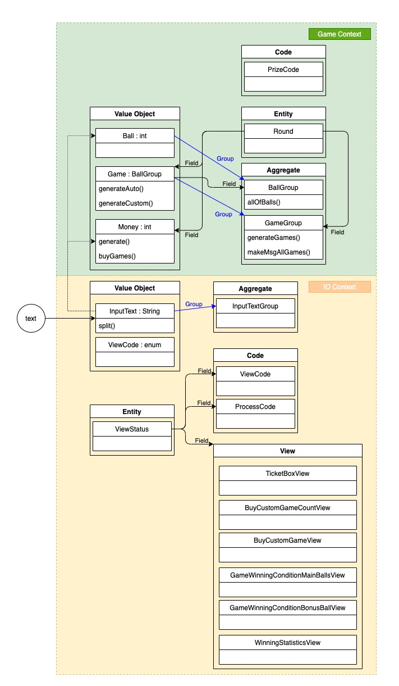

# 5단계 - 로또(수동)

## 1. 요구사항 정의

### 1.1. 명시된 요구사항

#### 1.1.1. 요구사항

- 현재 로또 생성기는 자동 생성 기능만 제공한다. 사용자가 수동으로 추첨 번호를 입력할 수 있도록 해야 한다.
- 입력한 금액, 자동 생성 숫자, 수동 생성 번호를 입력하도록 해야 한다.

#### 1.1.2. 실행 결과

```
구입금액을 입력해 주세요.
14000

수동으로 구매할 로또 수를 입력해 주세요.
3

수동으로 구매할 번호를 입력해 주세요.
8, 21, 23, 41, 42, 43
3, 5, 11, 16, 32, 38
7, 11, 16, 35, 36, 44

수동으로 3장, 자동으로 11개를 구매했습니다.
[8, 21, 23, 41, 42, 43]
[3, 5, 11, 16, 32, 38]
[7, 11, 16, 35, 36, 44]
[1, 8, 11, 31, 41, 42]
[13, 14, 16, 38, 42, 45]
[7, 11, 30, 40, 42, 43]
[2, 13, 22, 32, 38, 45]
[23, 25, 33, 36, 39, 41]
[1, 3, 5, 14, 22, 45]
[5, 9, 38, 41, 43, 44]
[2, 8, 9, 18, 19, 21]
[13, 14, 18, 21, 23, 35]
[17, 21, 29, 37, 42, 45]
[3, 8, 27, 30, 35, 44]

지난 주 당첨 번호를 입력해 주세요.
1, 2, 3, 4, 5, 6
보너스 볼을 입력해 주세요.
7

당첨 통계
---------
3개 일치 (5000원)- 1개
4개 일치 (50000원)- 0개
5개 일치 (1500000원)- 0개
5개 일치, 보너스 볼 일치(30000000원) - 0개
6개 일치 (2000000000원)- 0개
총 수익률은 0.35입니다.(기준이 1이기 때문에 결과적으로 손해라는 의미임)
```

#### 1.1.3. 힌트

- 규칙 3: 모든 원시값과 문자열을 포장한다.
   - 로또 숫자 하나는 int 타입이다. 이 숫자 하나를 추상화한 LottoNo 객체를 추가해 구현한다.
- 예외 처리를 통해 에러가 발생하지 않도록 한다.
   - 사용자가 잘못된 값을 입력했을 때 java exception으로 에러 처리를 한다.
   - java8에 추가된 Optional을 적용해 NullPointerException이 발생하지 않도록 한다.

### 1.2. 기능 요구사항 정리

|구분 | 상세 |구현방법     |
|:----:  |:------  |:---------|
|수동 구매 수 입력|• 수동 구매할 로또 갯수 입력 요청 메시지 출력<br>• 수동 구매할 로또 수 입력|• "수동으로 구매할 로또 수를 입력해 주세요." 출력<br>• 하나의 숫자만 입력한다.<br>• 다음의 조건을 만족하지 않는 경우 재입력 요청<br>&nbsp;&nbsp;&nbsp;1.`0` 이상의 자연수<br>&nbsp;&nbsp;&nbsp;2.구매 가능한 개수 이하의 자연수|
|수동 구매 로또 번호 입력|• 수동 구매할 로또 번호 입력 요청 메시지 출력<br>• 수동 구매 로또 번호 입력|• "수동으로 구매할 번호를 입력해 주세요." 출력<br>• 수동 구매 수가 `0`인 경우 해당 입력을 건너뛴다.<br>• 수동 구매 수만큼 반복하여 수동 로또 번호 입력을 요청한다.<br>• 다음의 조건을 만족하지 않는 경우 재입력 요청<br>&nbsp;&nbsp;&nbsp;1.`1~45` 사이의 자연수<br>&nbsp;&nbsp;&nbsp;2. 겹치지 않는 서로 다른 숫자 6개 조합|
|로또 구매|• 구매한 로또 개수 출력|• "수동으로 n장, 자동으로 m개를 구매했습니다."<br>• 구매한 로또 게임의 개수를 출력한다.<br>• 로또의 게임 당 오름차순으로 정렬된 값으로 보여준다.(각 게임 간 정렬은 하지 않는다.)|

### 1.3. 프로그래밍 요구사항

|구분|상세|구현 방법|
|:---:|:---|---|
|Convention|• 자바 코드 컨벤션을 지키면서 프로그래밍한다.<br>&nbsp;&nbsp;• https://naver.github.io/hackday-conventions-java/ <br>&nbsp;&nbsp;• https://google.github.io/styleguide/javaguide.html <br>&nbsp;&nbsp;•  https://myeonguni.tistory.com/1596 |- gradle-editorconfig 적용<br>- gradle-checkstyle 적용<br>- IntelliJ 적용<br>- Github 적용|
|enum|• java enum을 적용해 프로그래밍을 구현한다.|• Code값들은 enum을 활용하여 구현한다.|
|객체지향 생활 체조|• 규칙 3: 모든 원시값과 문자열을 포장한다.|• 원시값 또는 문자열을 객체(VO)로 포장한다.<br>• **1.1.3. 힌트** 참조|
|객체지향 생활 체조|• 규칙 5: 줄여쓰지 않는다(축약 금지).|• 네이밍에 약어를 사용하지 않는다.|
|객체지향 생활 체조|• 규칙 8: 일급 콜렉션을 쓴다.|• 값 객체(VO) 또는 엔티티(Entity)의 Collection을 일급 콜렉션으로 구현한다.|
|예외 처리|• 예외 처리를 통해 에러가 발생하지 않도록 한다.|• **2.1.2. Exception Control** 참조|
|메소드|• indent(인덴트, 들여쓰기) depth를 2가 넘지 않도록 구현한다. 1까지만 허용한다.<br>&nbsp;&nbsp;• 예를 들어 while문 안에 if문이 있으면 들여쓰기는 2이다.<br>&nbsp;&nbsp;• **힌트: indent(인덴트, 들여쓰기) depth를 줄이는 좋은 방법은 함수(또는 메소드)를 분리**하면 된다.|- < 2depth 규칙|
|메소드|• 함수(또는 메소드)의 길이가 15라인을 넘어가지 않도록 구현한다.<br>&nbsp;&nbsp;• 함수(또는 메소드)가 한 가지 일만 잘 하도록 구현한다.|- 함수(또는 메서드) 15라인 이하|
|메소드|• else 예약어를 쓰지 않는다.<br>&nbsp;&nbsp;• 힌트: if 조건절에서 값을 return하는 방식으로 구현하면 else를 사용하지 않아도 된다.<br>&nbsp;&nbsp;• else를 쓰지 말라고 하니 switch/case로 구현하는 경우가 있는데 switch/case도 허용하지 않는다.|- else 예약어 금지|
|테스트|• 모든 기능을 TDD로 구현해 단위 테스트가 존재해야 한다. 단, UI(System.out, System.in) 로직은 제외<br>&nbsp;&nbsp;• 핵심 로직을 구현하는 코드와 UI를 담당하는 로직을 구분한다.<br>&nbsp;&nbsp;•UI 로직을 InputView, ResultView와 같은 클래스를 추가해 분리한다.|- 핵심 로직 단위테스트|


### 1.4. 비기능 요구사항

|구분 |상세 |구현방법     |
|:----:  |:------  |:---------|
|요구사항|• 기능을 구현하기 전에 README.md 파일에 구현할 기능 목록을 정리해 추가한다.|- 요구사항 정의 정리|
|Convention|• git의 commit 단위는 앞 단계에서 README.md 파일에 정리한 기능 목록 단위로 추가한다.<br>&nbsp;&nbsp;• 참고문서 : [AngularJS Commit Message Conventions](https://gist.github.com/stephenparish/9941e89d80e2bc58a153)|- git commit 시 해당 convention 적용|
|인수인계|• **_1.4.2. 코드리뷰 요청 및 피드백_** 을 참조|- step 실행 후 진행|
|인수인계|• **_1.4.3. 다음 단계 미션 진행을 위한 준비_** 을 참조|- step 시작 전 진행|

#### 1.4.1. AngularJS Commit Message Conventions 중

- commit message 종류를 다음과 같이 구분

```
feat (feature)
 fix (bug fix)
 docs (documentation)
 style (formatting, missing semi colons, …)
 refactor
 test (when adding missing tests)
 chore (maintain)
 ```

#### 1.4.2. 코드리뷰 요청 및 피드백

- 실습을 끝내면 [코드 리뷰 1단계](https://github.com/next-step/nextstep-docs/blob/master/codereview/review-step1.md) 문서의 7단계, 8단계를 참고해 자신의 저장소에 push한다.
- 온라인 코드리뷰 요청 1단계 동영상<br>  [](https://www.youtube.com/watch?v=YkgBUt7zG5k)
- 코드 리뷰 2단계 문서를 참고해 코드 리뷰 요청(pull request)을 보내고, NextStep 우측 상단의 Github 아이콘을 클릭해 리뷰 요청을 보낸다.
- 피드백 또는 merge 될 때까지 기다린다.

> PR에 대한 수정 요청을 받아 코드를 수정하는 경우 새로운 PR을 보낼 필요가 없다.<br>코드를 수정한 후 add/commit/push만 하면 자동으로 해당 PR에 추가된다.

- 온라인 코드리뷰 요청 2단계 동영상<br>  [](https://www.youtube.com/watch?v=HnTdFJd0PtU)
  <br>

#### 1.4.3. 다음 단계 미션 진행을 위한 준비

- Slack을 통해 merge가 되는지 확인한 후에 [코드 리뷰 3단계](https://github.com/next-step/nextstep-docs/blob/master/codereview/review-step3.md) 과정으로 다음 단계 미션을 진행한다.
- 온라인 코드리뷰 요청 3단계 동영상<br>  [](https://www.youtube.com/watch?v=fzrT3eoecUw)
  <br>

## 2. 분석 및 설계

### 2.1. 이번 Step 핵심 목표

#### 2.1.1. TDD (Test-Driven Developmet) : production code보다 test code를 먼저 작성한다.

> Cycle : Test Fail ---> Test Passes ---> Refactor ---> Test Fail ---> ...

#### 2.1.2. Exception Control

##### 2.1.2.1. Checked-Unchecked Exception

> 출처 : [Checked Exception을 대하는 자세](https://cheese10yun.github.io/checked-exception/) 참조

|구분   |Checked Exception|Unchecked Exception|
|:---: |:---             |:---               |
|처리 여부|반드시 예외 처리 해야함|예외 처리 하지 않아도 됨 |
|Transaction<br>Rollback 여부|Rollback 안됨|Rollback 진행|
|대표 Exception|IOException,<br>SQLException|NullPointerException,<br>IllegalArgumentException|

**결론**

- 예외 복구 전략이 명확하고 그것이 가능하다면 `Checked Exception`을 `try`, `catch`로 잡고 해당 복구를 하는 것이 좋습니다.
- 하지만 그러한 경우는 흔하지 않으며 `Checked Exception`이 발생하면 **더 구체적인 `Unchecked Exception`**을 발생시키고 예외에 대한 메시지를 명확하게 전달하는 것이 효과적입니다.
- **무책임하게 상위 메서드로 `throw`를 던지는 행위는 하지 않는 것**이 좋습니다. 상위 메서드들의 책임이 그만큼 증가하기 때문입니다. 
- `Checked Exception`은 기본 트랜잭션의 속성에서는 `rollback`을 진행하지 않는 점도 알고 있어야 실수를 방지할 수 있습니다.

##### 2.1.2.2. Optional을 이용하여 Java의 NullPointerExcetpion을 피해보자.
> 출처 : [Optional을 이용하여 Java의 NullPointerExcetpion을 피해보자.](https://medium.com/@joongwon/optional%EC%9D%84-%EC%9D%B4%EC%9A%A9%ED%95%98%EC%97%AC-java%EC%9D%98-nullpointerexception%EC%9D%84-%ED%94%BC%ED%95%B4%EB%B3%B4%EC%9E%90-e9cac719a2d6) 참조

```java
Optional<Cart> optional = Optional.ofNullable(response.getCart()).orElse(new Cart());
Optional<Cart> optional = Optional.ofNullable(response.getCart()).orElseThrow(IllegalStateException::new);
```

#### 2.1.3. 로또 피드백 학습 내용

##### 2.1.3.1. 로또 TDD 강의 및 일급 콜렉션 적용 리펙토링

- TDD 시작하기
  - 요구사항 분석을 통한 기능 목록 작성
  - 객체 설계를 통해 어느 부분부터 구현을 시작할 것인지 결정
- TDD로 구현할 기능 찾기
  - 구현 중간 부분을 자르는 연습을 해야 한다.
  - 즉, 프로그램이 실행되는 특정 시점의 상태 값으로 시작한다는 것을 의미한다.
  - > 예1) 자동차 경주 게임 - 우승자 구하기<br>- 자동차 경주 게임을 완료한 시점의 자동차 상태 값을 테스트 코드에서 변경(또는 결정)할 수 있음을 의미한다. 
  - > 예2) 로또에서 TDD로 구현할 기능 찾기<br>- 로또 구매 금액을 전달하면 구매할 수 있는 로또의 장수를 반환한다.<br>- 구매할 로또의 장 수만큼 자동 구매할 경우 자동 로또 생성해 반환한다.<br>- 구매한 한장의 로또 번호와 당첨 번호를 넣으면 당첨 결과를 반환한다.<br>- 구매한 전체 로또의 당첨 결과를 입력하면 당첨금 총액을 반환한다.<br>- 당첨 금액과 구매 금액을 넣으면 수익률을 반환한다.
- 객체 설계를 어떻게 해야할지 모르겠다면...
  - 시작은 **클랙스 메소드 구현으로 시작한 후 지속적인 리팩토링**
  - 리팩토링할 때는 객체 지향 생활체조 원칙, 클린코드 원칙을 참고해 리팩토링

##### 2.1.3.2. private method에 대한 테스트 및 리팩토링

- 리펙토링 주의사항
  - 레거시 코드를 리팩토링하는 과정에서 레거시 코드를 지우고 새로 생성하는 것은 위험하다.
  - 따라서 레거시 코드를 복사한 다른 메서드를 생성하고, 리팩토링을 진행한다.
    - 리팩토링 메서드 생성 -> 단위테스트 -> 전체테스트 -> 교체 -> 단위테스트 -> ...
  - 레거시 코드가 더 이상 사용하지 않는 상태가 될 때 그때 제거한다.

##### 2.1.3.3. 객체 간 의존관계 연결, 메소드 인자 수를 최소화

- 메소드(함수)에 인자 수를 최소화한다. -클린코드 책 중에서
  - 메소드(함수)에서 이상적인 인자 개수는 0개(무항)이다. 다음은 1개이고, 다음은 2개이다.
  - 3개는 가능한 피하는 편이 좋다. 4개 이상은 특별한 이유가 있어도 사용하면 안된다. 
- 클래스 간의 의존관계 연결
  - 클래스를 분리할 때 또는 클래스를 분리한 후 **고민해야할 부분은 클래스 간의 의존관계를 어떻게 연결할 것인가?** 이다.
  - 의존관계를 줄이기 위해서 `인터페이스` 혹은 `추상 클래스`를 활용하는 것도 방법이다.  
- 상속(is-a 관계)과 조합(has-a 관계)
  - 일급콜렉션을 구현할 때 접근 방법으로 상속과 조합 방법으로 구현할 수 있다.
    - **조합** 방법으로 활용 하길 권장 : ArrayList를 상속해서 활용하는 경우 불필요한 메서드도 구현. 필요한 기능은 일급콜렉션에서 메시지를 전달해서 가져오도록하는 것이 좋음
  - 객체의 중복(Lotto와 WinningLotto)을 제거할 때 상속과 조합 방법으로 구현할 수 있다.
  - > Favor Object Composition over Class Ingeritance from Design Patterns 책에서<br>- 코드의 재사용성(Re-usability)측면에서는 상속이 유리하지만 유연성(flexibility)측면에서는 조합이 더 유리하다.<br>- 변화에 빠르게 대응하는 것이 점점 중요해지고 있는 현재는 재사용성보다 유연성이 훨씬 더 중요하다.
- 메소드의 위치를 바꿀 것을 고려해야할 상황들
  - 메소드의 접근제어자가 `private`인 경우
    - 테스트하는 것이 어려워질 수 있다.
    - 적절한 역할과 책임의 위임인지 판단이 필요하다.
  - 인자 수를 줄일 수 있는지 고민해본다.
    - 특정 클래스로 변경하여 메소드 인자를 줄일 수 있다면, 많은 경우 그 클래스의 역할과 책임을 가지고 있는 경우가 많다.

##### 2.1.3.4. 정적 팩토리 메소드, 인스턴스 캐싱

- 생성자 대신 정적 팩토리 메서드를 사용하라.
  - 생성자를 다양하게 가지는 것은 좋은 점이다.
  - 생성자를 작성하지 않으면 `public Lotto() {}`가 자동 생성 된다. 따라서 생성자를 따로 작성한 것이 없다면 `private Lotto() {}`를 통하여 생성자를 사용하지 않도록 방지한다.
    - 유효성이 검증되지 않은 객체가 생성되는 것을 방지할 수 있고,
    - 정적 팩토리 메서드 명을 통하여 생성되는 것인지 존재하는 것을 전달받는 것인지 유추할 수 있다.
  - mutable object(가변 객체)보다 immutable object(불변 객체) 기반으로 구현하라.  
- 인스턴스 캐싱
  - 반복되어 활용되는 객체의 경우에는 인스턴스를 미리 생성하여 재활용하는 것이 좋다.
  - > 예) Ball의 경우 1~45만 가지고 활용한다. 따라서 해당 값을 미리 인스턴스로 미리 생성하고 필요한 경우 추출해서 활용하는 것이 좋다. 

### 2.2. Todo List

- [x] 0.기본 세팅
    - [x] 0-1.git fork/clone
    - [x] 0-2.요구사항 정리
    - [x] 0-3.[AngularJS Commit Message Conventions](https://gist.github.com/stephenparish/9941e89d80e2bc58a153#generating-changelogmd) 참고
    - [x] 0-4.Slack을 통해 merge가 되는지 확인한 후에 코드 리뷰 5단계 과정으로 다음 단계 미션을 진행
        - [x] 0-4-1.gregolee(master) branch로 체크아웃 : `git checkout gregolee`
        - [x] 0-4-2.step4 branch 삭제 : `git branch -D step4`
        - [x] 0-4-3.step4 branch 삭제 확인 : `git branch -a`
        - [x] 0-4-4.원본(next-step) git repository를 remote로 연결 (미션 당 1회) : `git remote add -t gregolee upstream https://github.com/next-step/java-lotto`
        - [x] 0-4-5.원본(next-step) git repository를 remote로 연결 확인 : `git remote -v`
        - [x] 0-4-6.원본(next-step) git repository에서 merge된 나의 branch(gregolee)를 fetch : `git fetch upstream gregolee`
        - [x] 0-4-7.remote에서 가져온 나의 branch로 rebase : `git rebase upstream/gregolee`
        - [x] 0-4-7.gregolee -> step5로 체크아웃 : `git checkout -b step5`
    - [x] 0-5.리뷰어님의 리뷰를 반영한 코드로 수정
        - [x] 0-5-1.적용사항 없음
- [x] 1.자바 코드 컨벤션을 위한 세팅
    - [x] 1-1.[gradle-editorconfig](https://naver.github.io/hackday-conventions-java/#editorconfig) 적용
    - [x] 1-2.[gradle-checkstyle](https://naver.github.io/hackday-conventions-java/#checkstyle) 적용
    - [x] 1-3.[IntelliJ](https://naver.github.io/hackday-conventions-java/#_intellij) 적용
    - [x] 1-4.[Github](https://naver.github.io/hackday-conventions-java/#_github) 적용
- [x] 2.학습
    - [x] 2-0. [로또 피드백 동영상 페이지](https://edu.nextstep.camp/s/ffeVDScX/ls/zqukp28W)
    - [x] 2-1. 로또 TDD 강의 및 일급 콜렉션 적용 리펙토링
    - [x] 2-2. private method에 대한 테스트 및 리팩토링
    - [x] 2-3. 객체 간 의존관계 연결, 인자 수를 최소화
    - [x] 2-4. 정적 팩토리 메소드, 인스턴스 캐싱
- [x] 3.분석 및 설계
    - [x] 3-1.step05.md 작성
    - [x] 3-2.도메인 주도 설계 이미지 수정
- [x] 4.구현
    - [x] 4-1.Game Context
        - [x] 4-1-1.`Value Object` & `Aggregate`
            - [x] 4-1-1-1.`Ball(VO)`
                - [x] 4-1-1-1-1.`generate()` -> `of()` : 매번 공 객체를 생성하지 않고, 기존 1~45의 공만 활용하도록 한다. 
            - [x] 4-1-1-2.`CustomGameCount(VO)`
                - [x] 4-1-1-2-1.`validateGenerate()` : 0 이상의 자연수인지 검증한다.
                - [x] 4-1-1-2-2.`generate()` : 0 이상의 자연수만 생성 가능하도록 한다.
            - [x] 4-1-1-3.`Money(VO)`
                - [x] 4-1-1-3-1.`amountOfAutoGames` : 자동 생성할 금액을 계산한다.
                - [x] 4-1-1-3-2.`validateMoneyForGame()` -> `validateMoneyForAutoGame()`
                - [x] 4-1-1-3-3.`validateRaiseMoney()` : 최초 게임 구매 금액을 등록한다.
            - [x] 4-1-1-4.`GameGroup(Aggregate)`
              - [x] 4-1-1-3-1.`count()` : 생성된 게임의 수를 조회한다.
              - [x] 4-1-1-3-2.`buyCustomGame()` : 임의로 생성한 게임을 등록한다.
        - [x] 4-1-2.`Entity`
            - [x] 4-1-2-1.`Round`
                - [x] 4-1-2-1-1.`setupCustomGameCount()` : 수동 생성할 게임 수를 세팅한다.
                - [x] 4-1-2-1-2.`customGameCount()` : 수동 생성할 게임의 수를 조회한다.
                - [x] 4-1-2-1-3.`boughtGamesCount()` : 구매한 게임 수를 조회한다.
                - [x] 4-1-2-1-4.`buyCustomGame()` : 수동 구매한 게임을 등록한다.
                - [x] 4-1-2-1-5.`moneyOfAutoGames()` : 자동 구매할 금액을 조회한다.
                - [x] 4-1-2-1-6.`buyAutoGames()` : 자동 게임을 구매한다.
                - [x] 4-1-2-1-7.`isFinishBuyCustomGames()` : 수동 구매할 수만큼 번호를 지정했는지 확인 
        - [x] 4-1-3.`Exception`
            - [x] 4-1-3-1.`IllegalCustomGameCountException`
    - [x] 4-2.IO Context
        - [x] 4-2-1.`Value Object` & `Aggregate`
            - [x] 4-2-1-1.`ViewCode(Code)`
                - [x] 4-2-1-1-1.`view()` : 화면 인스턴스 리턴
                - [x] 4-2-1-1-2.`is~()` : 등가성 비교 제거
        - [x] 4-2-2.View
            - [x] 4-2-2-1.`TicketBoxView`
                - [x] 4-2-2-1-1.구매 금액 입력 후 수동 구매 입력 화면으로 변경
                - [x] 4-2-2-1-2.출력 메시지 변경
            - [x] 4-2-2-2.`WinningStaticsView`
                - [x] 4-2-2-2-1.당첨 수익률에 따라 출력 메시지 다르게 표출
            - [x] 4-2-2-3.`BuyCustomGameView` : 수동 게임 구매 화면
            - [x] 4-2-2-4.`BuyCustomGameCountView` : 수동 게임 구매 갯수 화면
        - [x] 4-2-3.`Entity`
            - [x] 4-2-3-1.붎필요한 메서드 제거
            - [x] 4-2-3-2.화면 조정 메서드 변경
    - [x] 4-3.Refactoring
        - [x] 4-3-1.`Ball` : `generate()` -> `of()` : 매번 공 객체를 생성하지 않고, 기존 1~45의 공만 활용하도록 한다.
        - [x] 4-3-2.`ViewCode` : 코드별 지정된 화면 인스턴스를 리턴하도록 한다.
- [ ] 5.테스트
    - [ ] 5-1.Gradle build Success 확인
        - [ ] 5-1-1.`Value Object` & `Aggregate`
            - [ ] 5-1-1-1.`Ball(VO)`
            - [ ] 5-1-1-2.`BallGroup(Aggregate)`
            - [ ] 5-1-1-3.`Game(VO)`
            - [ ] 5-1-1-4.`GameGroup(Aggregate)`
            - [ ] 5-1-1-5.`GameWinningCondition(VO)`
            - [ ] 5-1-1-6.`Money(VO)`
            - [ ] 5-1-1-7.`InputText(VO)`
            - [ ] 5-1-1-8.`InputTextGroup(Aggregate)`
            - [ ] 5-1-1-9.`ViewCode(VO)`
            - [ ] 5-1-1-10.`ProcessCode(VO)`
            - [ ] 5-1-1-11.`PrizeCode(VO)`
        - [ ] 5-1-2.`Entity`
            - [ ] 5-1-2-1.`Round`
    - [ ] 5-2.checkstyle 문제없는지 확인 (Java Convention)
    - [ ] 5-3.요구사항 조건들 충족했는지 확인
        - [ ] 5-3-1.< 2 Depth 규칙
        - [ ] 5-3-2.함수(또는 메서드) 15라인 이하
        - [ ] 5-3-3.else 예약어 금지
        - [ ] 5-3-4.Code값들은 `enum`을 활용한다.
        - [ ] 5-3-5.일급콜렉션 활용
        - [ ] 5-3-6.일급콜렉션 활용
        - [ ] 5-3-7.축약 금지
        - [ ] 5-3-8.예외 처리
- [ ] 6.인수인계
    - [ ] 6-1.소감 및 피드백 정리
        - [ ] 6-1-1.느낀점 & 배운점 작성
        - [ ] 6-1-2.피드백 요청 정리
    - [ ] 6-2.코드리뷰 요청 및 피드백
        - [ ] 6-1-1.step5를 gregolee/java-lotto로 push : `git push origin step5`
        - [ ] 6-1-2.pull request(PR) 작성
    - [ ] 6-3.Slack을 통해 merge가 되는지 확인한 후에 미션 종료

### 2.3. 설계

#### 2.3.1. Domain-Driven-Design (DDD)



## 3. 인수인계

### 3.1. 느낀점 & 배운점

#### 3.1.1. 느낀점

- 

#### 3.1.2. 배운점

- 


### 3.2. 피드백 요청

- 
