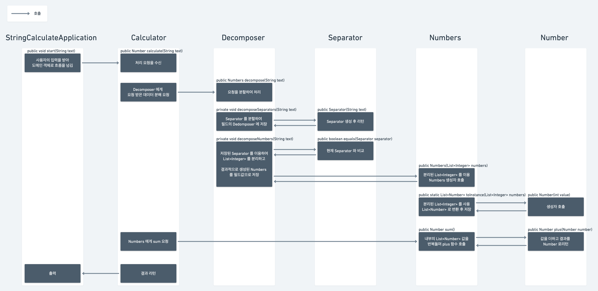

# 기능 요구사항

* 쉼표(,) 또는 콜론(:)을 구분자로 가지는 문자열을 전달하는 경우 구분자를 기준으로 
  분리한 각 숫자의 합을 반환 (예: “” => 0, "1,2" => 3, "1,2,3" => 6, “1,2:3” => 6)
* 앞의 기본 구분자(쉼표, 콜론)외에 커스텀 구분자를 지정할 수 있다.
  커스텀 구분자는 문자열 앞부분의 “//”와 “\n” 사이에 위치하는 문자를 커스텀 구분자로 사용한다. 
  예를 들어 “//;\n1;2;3”과 같이 값을 입력할 경우 커스텀 구분자는 세미콜론(;)이며, 결과 값은 6이 반환되어야 한다.
* 문자열 계산기에 숫자 이외의 값 또는 음수를 전달하는 경우 RuntimeException 예외를 throw한다.

# 구현 기능

클래스별로 나누어 기능을 구현한다



### StringCalculateApplication

* ```java
  public void start(String text)
  ```

### Calculator
* ```java
  public Number calculate(String text)
  ```

### Decomposer
* ```java
  public Numbers decompose(String text);
  ```
* ```java
  private void decomposeSeparators(String text)
  ```
* ```java
  private void decomposeNumbers(String text);
  ```

### Separator
* ```java
  public Separator(String text)
  ```
* ```java
  public boolean equals(Separator separator)
  ```

### Numbers
* ```java
  public Number sum()
  ```

### Number
* ```java
  public Number(int value)
  ```
* ```java
  public Number plus(Number number)
  ```