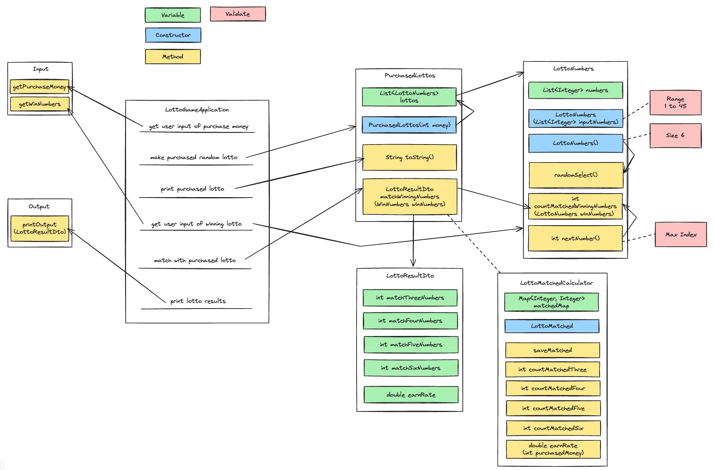

## 기능 요구사항
- 로또 구입 금액을 입력하면 구입 금액에 해당하는 로또를 발급해야 한다.
- 로또 1장의 가격은 1000원이다.

## 힌트
- 로또 자동 생성은 `Collections.shuffle()` 메소드 활용한다.
- `Collections.sort()` 메소드를 활용해 정렬 가능하다.
- `ArrayList`의 `contains()` 메소드를 활용하면 어떤 값이 존재하는지 유무를 판단할 수 있다.

## 프로그래밍 요구사항
- 모든 기능을 TDD로 구현해 단위 테스트가 존재해야 한다. 단, UI(System.out, System.in) 로직은 제외
- 핵심 로직을 구현하는 코드와 UI를 담당하는 로직을 구분한다.
- UI 로직을 InputView, ResultView와 같은 클래스를 추가해 분리한다.
- indent(인덴트, 들여쓰기) depth를 2를 넘지 않도록 구현한다. 1까지만 허용한다.
    - 예를 들어 while문 안에 if문이 있으면 들여쓰기는 2이다.
    - 힌트: indent(인덴트, 들여쓰기) depth를 줄이는 좋은 방법은 함수(또는 메소드)를 분리하면 된다.
- 함수(또는 메소드)의 길이가 15라인을 넘어가지 않도록 구현한다.
    - 함수(또는 메소드)가 한 가지 일만 잘 하도록 구현한다.
- 모든 로직에 단위 테스트를 구현한다. 단, UI(System.out, System.in) 로직은 제외
    - 핵심 로직을 구현하는 코드와 UI를 담당하는 로직을 구분한다.
    - UI 로직을 InputView, ResultView와 같은 클래스를 추가해 분리한다.
- 자바 코드 컨벤션을 지키면서 프로그래밍한다.
    - 참고문서: https://google.github.io/styleguide/javaguide.html 또는 https://myeonguni.tistory.com/1596
- else 예약어를 쓰지 않는다.
    - 힌트: if 조건절에서 값을 return하는 방식으로 구현하면 else를 사용하지 않아도 된다.
    - else를 쓰지 말라고 하니 switch/case로 구현하는 경우가 있는데 switch/case도 허용하지 않는다.

## 기능 목록 및 commit 로그 요구사항
- 기능을 구현하기 전에 README.md 파일에 구현할 기능 목록을 정리해 추가한다.
- git의 commit 단위는 앞 단계에서 README.md 파일에 정리한 기능 목록 단위로 추가한다.

# STEP 2

## 설계(구현 목록)
- 

#### Input
- [x] 금액을 입력받는다.
- [x] 우승 번호를 입력받는다.

#### Output
- [x] 로또 결과를 출력한다.

#### Domain - LottoNumbers
- 로또 번호 일급 컬렉션
- [x] 우승번호와 몇개 일치하는지 확인한다.
- [x] 랜덤 번호를 생성한다.
- [x] 다음 변수를 반환한다.

#### Domain - PurchasedLotto
- LottoNumbers 일급 컬렉션
- [x] 우승번호를 검증하여 DTO로 반환해준다.
- [x] 결과를 String으로 반환한다(`toString()`)

#### Domain - LottoMatched
- Lotto 결과 계산을 위해 사용

#### LottoResultDtoCalculator
- 로또 게임 결과 반환 Dto
- [x] 각 매칭 숫자 결과를 반환
- [x] 수익률 계산

#### LottoGameApplication
- `main` 메서드가 있는 클래스

# STEP 3

#### Input
- [x] 보너스볼의 추가 입력을 받는다.

#### LottoWinInfo
- [x] 우승 종류를 추가한다(보너스 볼 포함).

#### LottoNumbers
- [x] 보너스 볼을 체크한다.

#### LottoNumberWithBonusWrapper
- 로또 번호와 보너스 번호를 래핑한다.

# STEP 4

#### Input
- [ ] 수동 개수를 입력받는다.
- [ ] 구매 개수만큼 수동 로또를 입력받는다.
- [ ] 위 입력을 감싸는 객체를 만들어 준다.

#### Output
- [ ] 수동/자동 개수를 출력한다.
  - `LottoSheet`에게 질의

#### LottoSheet
- [ ] `Input`에서 받은 객체를 통해 자동/수동 로또를 생성한다.
- [ ] `LottoSheet`는 일급 컬렉션이 아닌 서비스 레이어기 때문에, 수동 개수를 저장한다.
  - 수동 개수를 리턴해 주는 메소드
  - 자동 개수를 리턴해 주는 메소드(전체 - 수동)

#### 예외처리
- [x] 로또 번호는 1~45만 받을 수 있다. -> `LottoBall`
- [x] 로또 번호는 6자리만 받을 수 있다. -> `LottoSheet`
- [x] 로또 번호는 숫자만 입력가능하다. -> `Input`
- [ ] 구매 개수보다 수동입력의 개수가 많을 수 없다. -> `LottoSheet`
- [x] 중복 번호는 입력할 수 없다
- [x] 보너스 번호는 중복될 수 없다.
