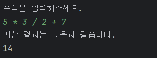
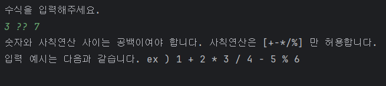
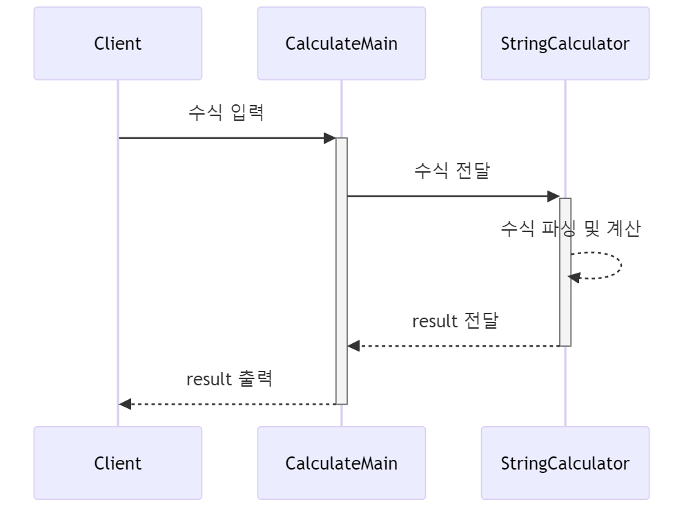

## 문자열 사칙 연산 계산기 구현

- 이번 미션의 핵심은 내가 구현하는 코드에 단위 테스트를 추가하는 경험을 하는 것이다.
- 모든 예외 상황을 처리하기 위해 너무 복잡하게 접근하지 않아도 된다.

## 기능 요구사항

- 사용자가 입력한 문자열 값에 따라 사칙연산을 수행할 수 있는 계산기를 구현해야 한다.
- 입력 문자열의 숫자와 사칙 연산 사이에는 반드시 빈 공백 문자열이 있다고 가정한다.
- 나눗셈의 경우 결과 값을 정수로 떨어지는 값으로 한정한다.
- 문자열 계산기는 사칙연산의 계산 우선순위가 아닌 입력 값에 따라 계산 순서가 결정된다. 즉, 수학에서는 곱셈, 나눗셈이 덧셈, 뺄셈 보다 먼저 계산해야 하지만 이를 무시한다.
- 예를 들어 2 + 3 * 4 / 2와 같은 문자열을 입력할 경우 2 + 3 * 4 / 2 실행 결과인 10을 출력해야 한다.

## 프로그래밍 요구사항

- indent(들여쓰기) depth를 2단계에서 1단계로 줄여라.
    - depth의 경우 if문을 사용하는 경우 1단계의 depth가 증가한다. if문 안에 while문을 사용한다면 depth가 2단계가 된다.
- 메소드의 크기가 최대 10라인을 넘지 않도록 구현한다.
    - method가 한 가지 일만 하도록 최대한 작게 만들어라.
- else를 사용하지 마라.

## 기능 분리 힌트

- 테스트할 수 있는 단위로 나누어 구현 목록을 만든다.

## 구현 할 기능

1. 구현 할 기능을 정리하고 실패하는 테스트를 먼저 작성한다.
2. 입력을 받아 사칙연산 수행 후 반환하는 기능
    1. 덧셈
    2. 뺄셈
    3. 곱셈
    4. 나눗셈
3. Validation 처리
    1. 입력 값이 null 이거나 빈 공백 문자일 경우 throw
    2. 숫자와 사칙연산 사이 빈 공백이 아니면 throw
    3. 사칙연산 기호가 아닌 특수문자일 경우 throw
    4. 나누기 0 할시 throw
4. 나눗셈 결과는 정수로 떨어져야 한다.
5. 사칙연산의 계산 우선순위가 아닌 입력값에 따라 계산순위가 결정되어야 한다.

## 입출력 예시 , 테스트 방법

- 입출력 예시 (성공, 실패)

- 테스트
    - StringCalculatorTest 실행 후 정상동작을 확인한다.

## 시퀀스 다이어그램

## 라이브러리

테스트에 사용중인 라이브러리는 다음과 같다.

- org.assertj:assertj-core:3.22.0
- org.junit.jupiter:junit-jupiter:5.8.2