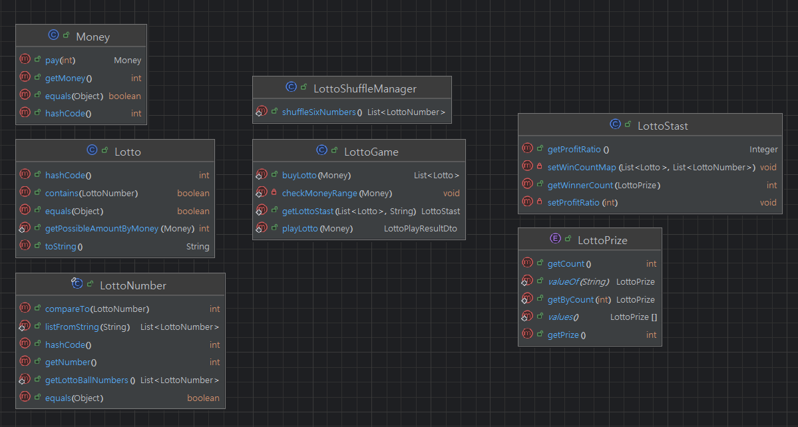
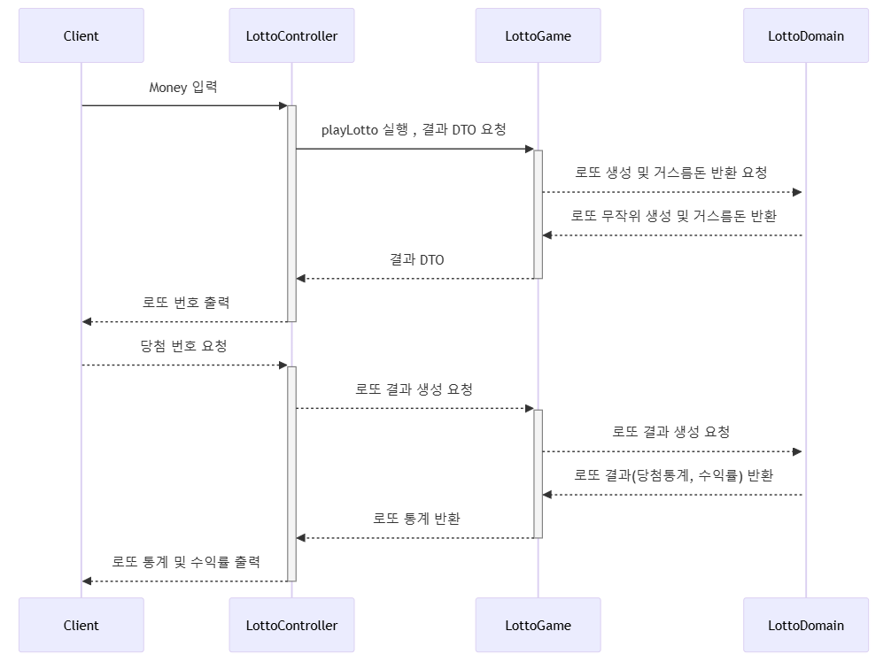

## 기능 요구사항

- 로또 구입 금액을 입력하면 구입 금액에 해당하는 로또를 발급해야 한다.
- 로또 1장의 가격은 1000원이다.
- 2등을 위해 추가 번호를 하나 더 추첨한다.
- 당첨 통계에 2등도 추가해야 한다.

## 입출력 예시

```
구입금액을 입력해 주세요.
14000
14 개를 구매했습니다.
[8, 9, 17, 25, 28, 39]
[6, 9, 18, 20, 21, 22]
[10, 16, 19, 36, 39, 40]
[16, 21, 26, 39, 40, 43]
[2, 5, 24, 33, 37, 38]
[1, 3, 4, 8, 21, 29]
[9, 13, 14, 15, 32, 34]
[8, 12, 15, 26, 37, 44]
[3, 5, 18, 34, 39, 44]
[1, 7, 9, 11, 18, 27]
[19, 24, 29, 39, 40, 43]
[2, 5, 18, 19, 43, 44]
[5, 6, 14, 19, 31, 35]
[6, 12, 15, 18, 20, 43]

지난 주 당첨 번호를 입력해 주세요.
1, 7, 9, 10, 12, 15
보너스 볼을 입력해 주세요.
8

당첨 통계
---------
0개 일치 (0원) - 6개
1개 일치 (0원) - 4개
2개 일치 (0원) - 3개
3개 일치 (5000원) - 1개
4개 일치 (50000원) - 0개
5개 일치 (1500000원) - 0개
5개 일치, 보너스 볼 일치(30000000원) - 0개
6개 일치 (2000000000원) - 0개
총 수익률은 -64% 입니다.

로또를 사고 남은 거스름돈 0원을 받았습니다.
```

## 힌트

- 로또 자동 생성은 Collections.shuffle() 메소드 활용한다.
- Collections.sort() 메소드를 활용해 정렬 가능하다.
- ArrayList의 contains() 메소드를 활용하면 어떤 값이 존재하는지 유무를 판단할 수 있다.
- 일급 콜렉션을 쓴다.
    - 6개의 숫자 값을 가지는 java collection을 감싸는 객체를 추가해 구현해 본다.
- 하드 코딩을 하지 않기 위해 상수 값을 사용하면 많은 상수 값이 발생한다.
- 자바의 enum을 활용해 상수 값을 제거한다. 즉, enum을 활용해 일치하는 수를 로또 등수로 변경해 본다.

## 프로그래밍 요구사항

- 모든 기능을 TDD로 구현해 단위 테스트가 존재해야 한다. 단, UI(System.out, System.in) 로직은 제외
    - 핵심 로직을 구현하는 코드와 UI를 담당하는 로직을 구분한다.
    - UI 로직을 InputView, ResultView와 같은 클래스를 추가해 분리한다.
- indent(인덴트, 들여쓰기) depth를 2를 넘지 않도록 구현한다. 1까지만 허용한다.
    - 예를 들어 while문 안에 if문이 있으면 들여쓰기는 2이다.
    - 힌트: indent(인덴트, 들여쓰기) depth를 줄이는 좋은 방법은 함수(또는 메소드)를 분리하면 된다.
- 함수(또는 메소드)의 길이가 15라인을 넘어가지 않도록 구현한다.
    - 함수(또는 메소드)가 한 가지 일만 잘 하도록 구현한다.
- 모든 로직에 단위 테스트를 구현한다. 단, UI(System.out, System.in) 로직은 제외
    - 핵심 로직을 구현하는 코드와 UI를 담당하는 로직을 구분한다.
    - UI 로직을 InputView, ResultView와 같은 클래스를 추가해 분리한다.
- 자바 코드 컨벤션을 지키면서 프로그래밍한다.
    - 참고문서: https://google.github.io/styleguide/javaguide.html 또는 https://myeonguni.tistory.com/1596
- else 예약어를 쓰지 않는다.
    - 힌트: if 조건절에서 값을 return하는 방식으로 구현하면 else를 사용하지 않아도 된다.
    - else를 쓰지 말라고 하니 switch/case로 구현하는 경우가 있는데 switch/case도 허용하지 않는다.
- java enum을 적용해 프로그래밍을 구현한다.
- 규칙 8: 일급 콜렉션을 쓴다.

## 구현 할 기능

1. 로또 당첨 처리 시 보너스 볼을 처리한다.
2. java Enum으로 정리한다.
3. Lotto를 일급 컬렉션으로 관리한다

## 실행 및 테스트 방법

- 실행
    - step2 view에 LottoController의 main 함수를 실행한다.
- 테스트
    - step2 디렉토리 안에 있는 테스트를 일괄 실행한다.

## 프로젝트 구성 / 다이어그램

- JAVA 11버전 이상
- GRADLE
- 내부 클래스 다이어그램
    - 
- 시퀀스 다이어그램
    - 

## 라이브러리

테스트에 사용중인 라이브러리는 다음과 같다.

- org.assertj:assertj-core:3.22.0
- org.junit.jupiter:junit-jupiter:5.8.2